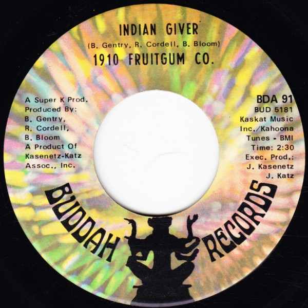

# Indian Giver

By 1910 Fruitgum Company

## Album Data

[Discogs URL](https://www.discogs.com/release/4932188-1910-Fruitgum-Company-Indian-Giver)

- Catalog #: BDA 91
- Label: Buddah Records
- Format: 7", ARP
- Rating: 
- Released: 1969
- Release ID: 4932188
- Media condition: Very Good Plus (VG+)
- Sleeve condition: 
- Speed: 45 rpm
- Weight: 

## See also

- ["1, 2, 3, Red Light"](1__2__3__Red_Light.md)
- [Special Delivery / No Good Annie](Special_Delivery_-_No_Good_Annie.md)
