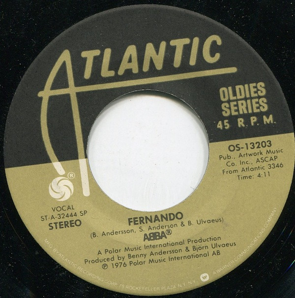

# Fernando / Dancing Queen

By ABBA

## Album Data

[Discogs URL](https://www.discogs.com/release/3721496-ABBA-Fernando-/-Dancing-Queen)

- Catalog #: OS-13203
- Label: Atlantic
- Format: 7", Single
- Rating: 
- Released: 1979
- Release ID: 3721496
- Media condition: Very Good (VG)
- Sleeve condition: 
- Speed: 45 rpm
- Weight: 

## Album Tracks

| **Position** | **Title** | **Duration** |
|--------------|-----------|--------------|
| A | **Fernando** | 4:11 |
| AA | **Dancing Queen** | 3:50 |

## See also

- [Gold (Greatest Hits)](Gold_Greatest_Hits.md)
- [Super Trouper](Super_Trouper.md)
- [Roon: ABBA Gold](../../Roon/ABBA/ABBA_Gold.md)
- [Roon: Abba](../../Roon/ABBA/Abba.md)
- [Roon: Arrival](../../Roon/ABBA/Arrival.md)
- [Roon: More ABBA Gold](../../Roon/ABBA/More_ABBA_Gold.md)
- [Roon: Super Trouper](../../Roon/ABBA/Super_Trouper.md)
- [Roon: The Visitors](../../Roon/ABBA/The_Visitors.md)
- [Roon: Voulez-Vous](../../Roon/ABBA/Voulez-Vous.md)
- [Roon: Voyage](../../Roon/ABBA/Voyage.md)
- [Roon: Waterloo](../../Roon/ABBA/Waterloo.md)
