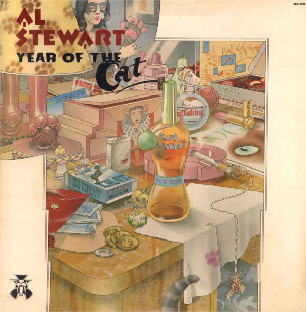

# Year Of The Cat

By Al Stewart

## Album Data

[Discogs URL](https://www.discogs.com/release/1804793-Al-Stewart-Year-Of-The-Cat)

- Catalog #: J-266
- Label: Janus Records
- Formats: Vinyl, Terre Haute Pressing
- Format: 7", Single, Styrene, Ter, 45 RPM
- Rating: 
- Released: 1976
- Year: 1976
- Release ID: 1804793
- Media condition: Very Good Plus (VG+)
- Sleeve condition: 
- Speed: 45 rpm
- Weight: 

## Album Tracks

| **Position** | **Title** | **Duration** |
|--------------|-----------|--------------|
| A | **Year Of The Cat** | 4:32 |
| B | **Broadway Hotel** | 3:55 |

## Artist Roles

| **Name** | **Role** |
|----------|----------|
| **Allen Zentz** | Mastered By |
| **Alan Parsons** | Producer |
| **Al Stewart** | Written-By |

## See also

- 
- [Roon: Year Of The Cat (Digitally remastered at Abbey Road Studios in 2001)](../../Roon/Al_Stewart/Year_Of_The_Cat_Digitally_remastered_at_Abbey_Road_Studios_in_2001.md)
