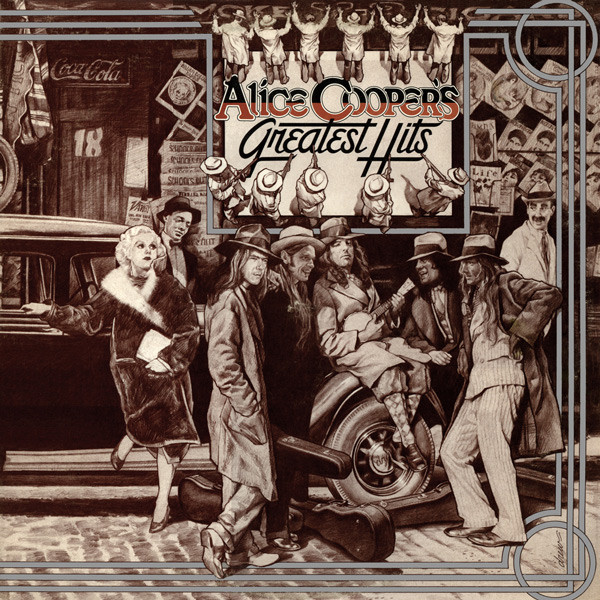

# Alice Cooper's Greatest Hits

By Alice Cooper

## Album Data

[Discogs URL](https://www.discogs.com/release/2567456-Alice-Cooper-Alice-Cooper's-Greatest-Hits)

- Catalog #: W 2803
- Label: Warner Bros. Records
- Formats: Vinyl
- Format: LP, Comp
- Rating: 
- Released: 1974
- Year: 1974
- Release ID: 2567456
- Media condition: Very Good Plus (VG+)
- Sleeve condition: Very Good (VG)
- Speed: 33 rpm
- Weight: 

## Album Tracks

| **Position** | **Title** | **Duration** |
|--------------|-----------|--------------|
| A1 | **I'm Eighteen** | 2:55 |
| A2 | **Is It My Body** | 2:40 |
| A3 | **Desperado** | 3:26 |
| A4 | **Under My Wheels** | 2:44 |
| A5 | **Be My Lover** | 3:18 |
| A6 | **School's Out** | 3:28 |
| B1 | **Hello Hooray** | 4:16 |
| B2 | **Elected** | 4:06 |
| B3 | **No More Mr. Nice Guy** | 3:05 |
| B4 | **Billion Dollar Babies** | 3:36 |
| B5 | **Teenage Lament '74** | 3:54 |
| B6 | **Muscle Of Love** | 3:46 |

## Artist Roles

| **Name** | **Role** |
|----------|----------|
| **Dennis Dunaway** | Bass |
| **Pacific Eye & Ear** | Design Concept |
| **Neal Smith** | Drums |
| **Glen Buxton** | Guitar |
| **Michael Bruce** | Guitar |
| **Bill Garland** | Illustration |
| **Drew Struzan** | Illustration |
| **Alice Cooper (2)** | Vocals |

## See also

- [Killer](Killer.md)
- [Beets: Alice Cooper’s Greatest Hits](../../Beets/Alice_Cooper/Alice_Cooper’s_Greatest_Hits.md)
- [Beets: Welcome to My Nightmare](../../Beets/Alice_Cooper/Welcome_to_My_Nightmare.md)
