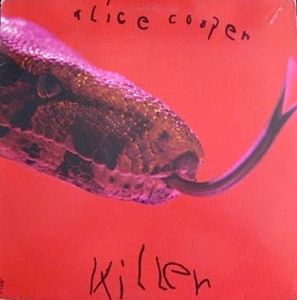

# Killer

By Alice Cooper

## Album Data

[Discogs URL](https://www.discogs.com/release/9664749-Alice-Cooper-Killer)

- Catalog #: BS 2567, 2567
- Label: Warner Bros. Records, Warner Bros. Records
- Format: LP, Album, Gat
- Rating: 
- Released: 1971
- Release ID: 9664749
- Media condition: Very Good Plus (VG+)
- Sleeve condition: Good Plus (G+)
- Speed: 33 rpm
- Weight: 

## Album Tracks

| **Position** | **Title** | **Duration** |
|--------------|-----------|--------------|
| A1 | **Under My Wheels** | 2:50 |
| A2 | **Be My Lover** | 3:15 |
| A3 | **Halo Of Flies** | 8:21 |
| A4 | **Desperado** | 3:25 |
| B1 | **You Drive Me Nervous** | 2:24 |
| B2 | **Yeah, Yeah, Yeah** | 3:33 |
| B3 | **Dead Babies** | 5:40 |
| B4 | **Killer** | 7:07 |

## Artist Roles

| **Name** | **Role** |
|----------|----------|
| **Alice Cooper (2)** | Design [Album Design] |
| **Brian Christian** | Engineer [Recording Engineer] |
| **Jack Richardson** | Executive-Producer |
| **Randy Kling** | Lacquer Cut By |
| **Randy Kling** | Lacquer Cut By |
| **Randy Kling** | Mastered By |
| **Kachina** | Other [Boa Constrictor] |
| **Pete Turner (4)** | Photography By |
| **Bob Ezrin** | Producer, Arranged By [String And Horn Arrangements] |
| **Joe Lopes** | Technician [Recording Technician] |

## See also

- [Alice Cooper's Greatest Hits](Alice_Coopers_Greatest_Hits.md)
- [Beets: Alice Cooper’s Greatest Hits](../../Beets/Alice_Cooper/Alice_Cooper’s_Greatest_Hits.md)
- [Beets: Welcome to My Nightmare](../../Beets/Alice_Cooper/Welcome_to_My_Nightmare.md)
