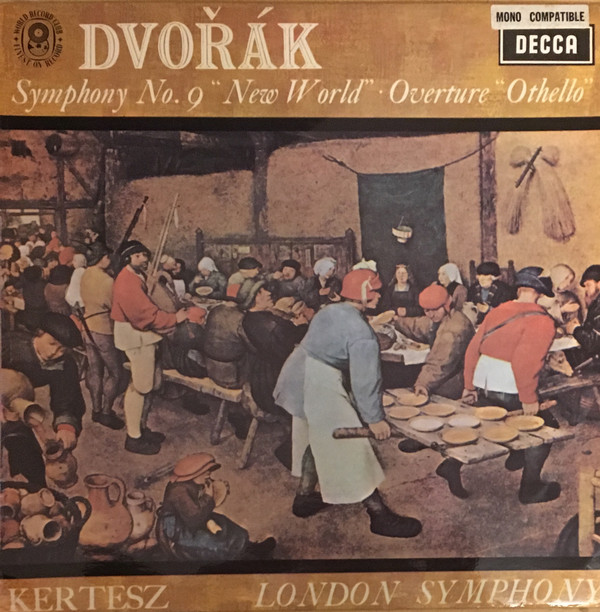

# "Symphony No. 9 ""New World"" ● Overture ""Othello"""

By Antonín Dvořák - István Kertész - The London Symphony Orchestra

## Album Data

[Discogs URL](https://www.discogs.com/release/10033594-Antonín-Dvořák---István-Kertész---The-London-Symphony-Orchestra-"Symphony-No.-9-""New-World""-●-Overture-""Othello""")

- Catalog #: SXL 6291
- Label: Decca
- Formats: Vinyl
- Format: LP
- Rating: 
- Released: 2016
- Year: 1967
- Release ID: 10033594
- Media condition: Mint (M)
- Sleeve condition: Mint (M)
- Speed: 33 rpm
- Weight: 180 gram

## Album Tracks

| **Position** | **Title** | **Duration** |
|--------------|-----------|--------------|
|  | **Symphony No. 9 In E Minor, Op. 95** |  |
| B2 | **"Othello" Overture, Op. 93** |  |

## Artist Roles

| **Name** | **Role** |
|----------|----------|
| **Antonín Dvořák** | Composed By |
| **István Kertész** | Conductor |
| **Pieter Bruegel the Elder** | Cover [Painting; Uncredited; <i>"The Peasant Wedding"</i>] |
| **The London Symphony Orchestra** | Orchestra |

## See also

- 
