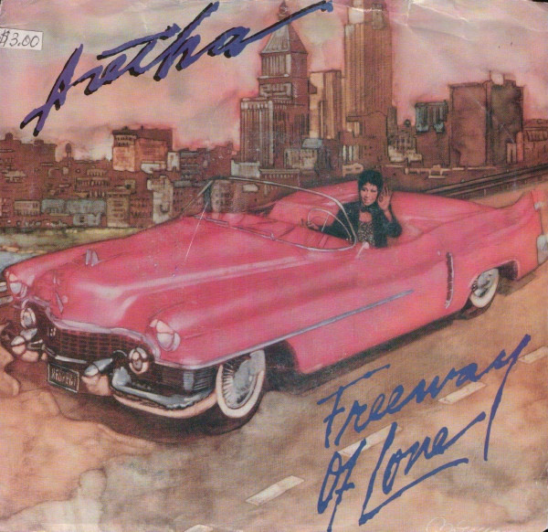

# Freeway Of Love

By Aretha Franklin

## Album Data

[Discogs URL](https://www.discogs.com/release/1842535-Aretha-Franklin-Freeway-Of-Love)

- Catalog #: AS1-9354
- Label: Arista
- Format: 7"
- Rating: 
- Released: 1985
- Release ID: 1842535
- Media condition: Very Good Plus (VG+)
- Sleeve condition: Near Mint (NM or M-)
- Speed: 45 rpm
- Weight: 

## See also

- 
- [Beets: Gospel Greats](../../Beets/Aretha_Franklin/Gospel_Greats.md)
- [Beets: I Never Loved a Man the Way I Love You](../../Beets/Aretha_Franklin/I_Never_Loved_a_Man_the_Way_I_Love_You.md)
- [Roon: Aretha In Person with The Ray Bryant Combo (Expanded Edition)](../../Roon/Aretha_Franklin/Aretha_In_Person_with_The_Ray_Bryant_Combo_Expanded_Edition.md)
- [Roon: Aretha](../../Roon/Aretha_Franklin/Aretha.md)
- [Roon: Aretha Now](../../Roon/Aretha_Franklin/Aretha_Now.md)
- [Roon: I Never Loved A Man The Way I Loved You](../../Roon/Aretha_Franklin/I_Never_Loved_A_Man_The_Way_I_Loved_You.md)
- [Roon: Lady Soul](../../Roon/Aretha_Franklin/Lady_Soul.md)
- [Roon: Soul '69](../../Roon/Aretha_Franklin/Soul_69.md)
- [Roon: Spirit in the Dark](../../Roon/Aretha_Franklin/Spirit_in_the_Dark.md)
- [Roon: The Electrifying Aretha Franklin (Expanded Edition)](../../Roon/Aretha_Franklin/The_Electrifying_Aretha_Franklin_Expanded_Edition.md)
- [Roon: The Tender, The Moving, The Swinging Aretha Franklin (Expanded Edition)](../../Roon/Aretha_Franklin/The_Tender__The_Moving__The_Swinging_Aretha_Franklin_Expanded_Edition.md)
- [Roon: Young, Gifted and Black](../../Roon/Aretha_Franklin/Young__Gifted_and_Black.md)
