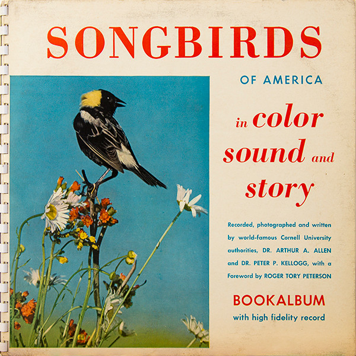

# Songbirds Of America

By Arthur A. Allen & Peter Paul Kellogg

## Album Data

[Discogs URL](https://www.discogs.com/release/4564324-Arthur-A.-Allen-&-Peter-Paul-Kellogg-Songbirds-Of-America)

- Catalog #: CU-11-NS-965-33
- Label: Cornell University Records
- Format: 10", RE, Boo
- Rating: 
- Released: 1963
- Release ID: 4564324
- Media condition: Very Good Plus (VG+)
- Sleeve condition: Very Good Plus (VG+)
- Speed: 33 rpm
- Weight: 

