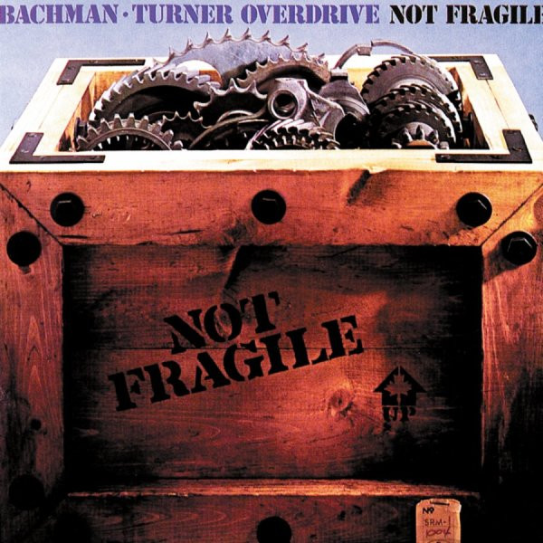

# Not Fragile

By Bachman-Turner Overdrive

## Album Data

[Discogs URL](https://www.discogs.com/release/3430931-Bachman-Turner-Overdrive-Not-Fragile)

- Catalog #: SRM 1-1004
- Label: Mercury
- Format: LP, Album, San
- Rating: 
- Released: 1974
- Release ID: 3430931
- Media condition: Very Good Plus (VG+)
- Sleeve condition: Very Good Plus (VG+)
- Speed: 33 rpm
- Weight: 

## See also

- [Bachman-Turner Overdrive II](Bachman-Turner_Overdrive_II.md)
