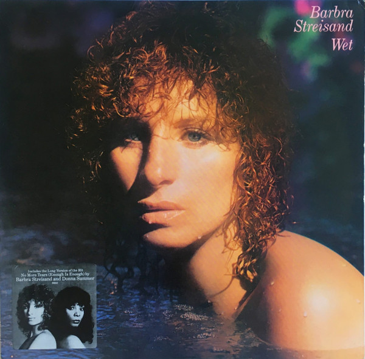

# Wet

By Barbra Streisand

## Album Data

[Discogs URL](https://www.discogs.com/release/1696734-Barbra-Streisand-Wet)

- Catalog #: FC 36258
- Label: Columbia
- Format: LP, Album, Ter
- Rating: 
- Released: 1979
- Release ID: 1696734
- Media condition: Very Good Plus (VG+)
- Sleeve condition: Very Good Plus (VG+)
- Speed: 33 rpm
- Weight: 

## Album Tracks

| **Position** | **Title** | **Duration** |
|--------------|-----------|--------------|
| A1 | **Wet** | 3:56 |
| A2 | **Come Rain Or Come Shine** | 4:43 |
| A3 | **Splish Splash** | 4:15 |
| A4 | **On Rainy Afternoons** | 3:08 |
| A5 | **After The Rain** | 3:40 |
| B1 | **No More Tears (Enough Is Enough)** | 8:19 |
| B2 | **Niagara** | 3:30 |
| B3 | **I Ain't Gonna Cry Tonight** | 5:00 |
| B4 | **Kiss Me In The Rain** | 4:16 |

## Artist Roles

| **Name** | **Role** |
|----------|----------|
| **Greg Mathieson** | Arranged By, Conductor |
| **Lee Holdridge** | Arranged By, Conductor |
| **Gayle Levant** | Harp |
| **Bobbye Hall** | Percussion |
| **Gary Coleman** | Percussion |
| **Paulinho Da Costa** | Percussion |
| **Gary Klein** | Producer |
| **Greg Mathieson** | Synthesizer |
| **Ian Underwood** | Synthesizer |
| **Michael Boddicker** | Synthesizer |

## See also

- 
