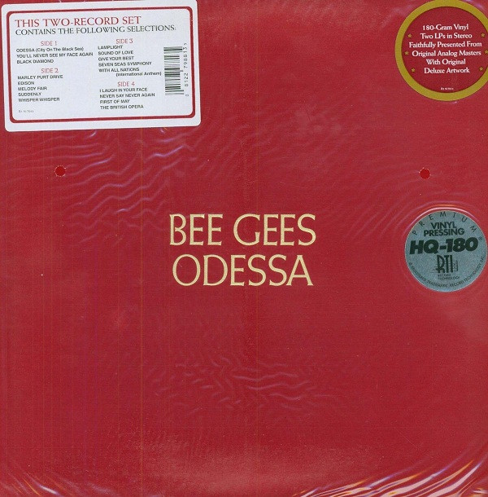

# Odessa

By Bee Gees

## Album Data

[Discogs URL](https://www.discogs.com/release/1930742-Bee-Gees-Odessa)

- Catalog #: SD 2-702
- Label: ATCO Records
- Format: 2xLP, Album, Pit
- Rating: 
- Released: 1969
- Release ID: 1930742
- Media condition: Good Plus (G+)
- Sleeve condition: Fair (F)
- Speed: 33 rpm
- Weight: 

## See also

- [To Love Somebody / How Can You Mend A Broken Heart](To_Love_Somebody_-_How_Can_You_Mend_A_Broken_Heart.md)
