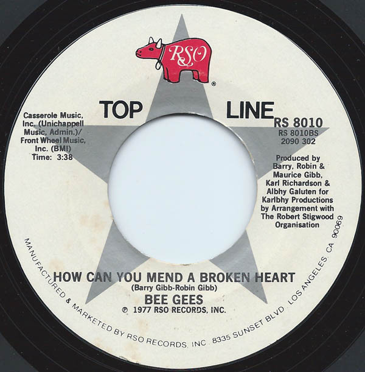

# To Love Somebody / How Can You Mend A Broken Heart

By Bee Gees

## Album Data

[Discogs URL](https://www.discogs.com/release/1861891-Bee-Gees-To-Love-Somebody-/-How-Can-You-Mend-A-Broken-Heart)

- Catalog #: RS 8010
- Label: RSO
- Format: 7", Single
- Rating: 
- Released: 1980
- Release ID: 1861891
- Media condition: Very Good Plus (VG+)
- Sleeve condition: Very Good (VG)
- Speed: 45 rpm
- Weight: 

## See also

- [Odessa](Odessa.md)
