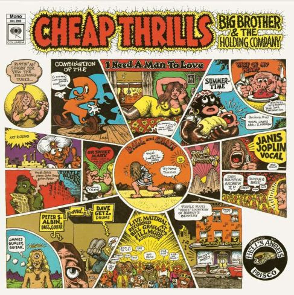

# Cheap Thrills

By Big Brother & The Holding Company

## Album Data

[Discogs URL](https://www.discogs.com/release/4056419-Big-Brother-&-The-Holding-Company-Cheap-Thrills)

- Catalog #: 88691947991, KCL 2900
- Label: Legacy, Columbia
- Formats: Vinyl, Gatefold
- Format: LP, Album, Mono, Ltd, Num, RE, Gat
- Rating: 
- Released: 2012
- Year: 1968
- Release ID: 4056419
- Media condition: Mint (M)
- Sleeve condition: Mint (M)
- Speed: 33 rpm
- Weight: 

## Album Tracks

| **Position** | **Title** | **Duration** |
|--------------|-----------|--------------|
| A1 | **Combination Of The Two** | 5:47 |
| A2 | **I Need A Man To Love** | 4:51 |
| A3 | **Summertime** | 3:56 |
| A4 | **Piece Of My Heart** | 4:13 |
| B1 | **Turtle Blues** | 4:20 |
| B2 | **Oh, Sweet Mary** | 4:13 |
| B3 | **Ball And Chain** | 9:27 |

## Artist Roles

| **Name** | **Role** |
|----------|----------|
| **Peter Albin** | Bass |
| **Sam Andrew** | Bass, Guitar |
| **Robert Crumb** | Cover [Cover Artwork] |
| **Dave Getz** | Drums |
| **Fred Catero** | Engineer |
| **James Gurley** | Engineer |
| **Janis Joplin** | Engineer |
| **Jerry Hochman** | Engineer |
| **Roy Segal** | Engineer |
| **James Gurley** | Guitar |
| **Kevin Gray** | Mastered By, Lacquer Cut By |
| **Janis Joplin** | Vocals |

## See also

- 
