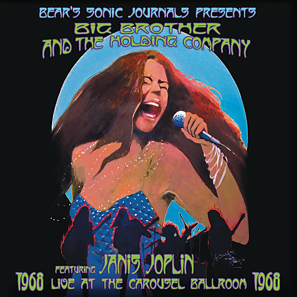

# Live At The Carousel Ballroom 1968

By Big Brother & The Holding Company featuring Janis Joplin

## Album Data

[Discogs URL](https://www.discogs.com/release/3974330-Big-Brother-&-The-Holding-Company-featuring-Janis-Joplin-Live-At-The-Carousel-Ballroom-1968)

- Catalog #: MOVLP527, none
- Label: Music On Vinyl, Legacy, Columbia
- Format: 2xLP, Album, RM, 180
- Rating: 
- Released: 2012
- Release ID: 3974330
- Media condition: Mint (M)
- Sleeve condition: Mint (M)
- Speed: 33 rpm
- Weight: 180 gram

