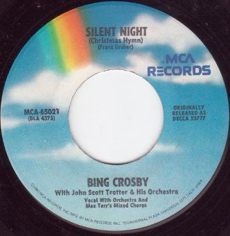

# "Silent Night (Christmas Hymn) / Adeste Fideles (Oh, Come, All Ye Faithful)"

By Bing Crosby

## Album Data

[Discogs URL](https://www.discogs.com/release/4875711-Bing-Crosby-"Silent-Night-(Christmas-Hymn)-/-Adeste-Fideles-(Oh,-Come,-All-Ye-Faithful)")

- Catalog #: MCA-65021
- Label: MCA Records
- Format: 7", RE, Pin
- Rating: 
- Released: 1980
- Release ID: 4875711
- Media condition: Very Good (VG)
- Sleeve condition: 
- Speed: 45 rpm
- Weight: 

