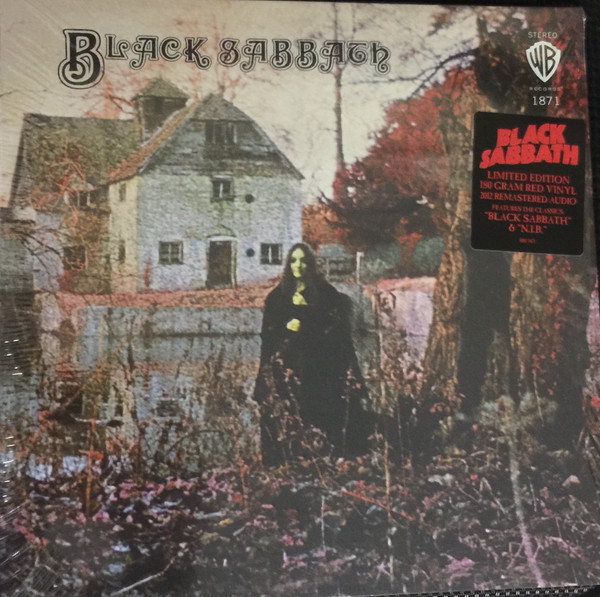

# Black Sabbath

By Black Sabbath

## Album Data

[Discogs URL](https://www.discogs.com/release/8867448-Black-Sabbath-Black-Sabbath)

- Catalog #: RR1 1871, 1871
- Label: Rhino Records (2), Warner Bros. Records
- Format: LP, Album, Ltd, RE, RM, Red
- Rating: 
- Released: 2016
- Release ID: 8867448
- Media condition: Mint (M)
- Sleeve condition: Mint (M)
- Speed: 33 rpm
- Weight: 180 gram

## Album Tracks

| **Position** | **Title** | **Duration** |
|--------------|-----------|--------------|
| A1 | **Black Sabbath** |  |
| A2 | **The Wizard** |  |
| A3 | **Wasp/Behind The Wall Of Sleep/Bassically/N.I.B.** |  |
| B1 | **Wicked World** |  |
| B2 | **A Bit Of Finger** |  |
| B3 | **Sleeping Village** |  |
| B4 | **Warning** |  |

## Artist Roles

| **Name** | **Role** |
|----------|----------|
| **Geezer Butler** | Bass Guitar |
| **Keef (4)** | Design, Photography By |
| **Bill Ward** | Drums |
| **Barry Sheffield** | Engineer |
| **Tom Allom** | Engineer |
| **Tony Iommi** | Lead Guitar |
| **Rodger Bain** | Producer |
| **Ozzy Osbourne** | Vocals, Harmonica |

## See also

- [Master Of Reality](Master_Of_Reality.md)
- [Paranoid](Paranoid.md)
- [Beets: Black Sabbath](../../Beets/Black_Sabbath/Black_Sabbath.md)
- [Beets: Dazed and Confused Soundtrack](../../Beets/Black_Sabbath/Dazed_and_Confused_Soundtrack.md)
- [Beets: Master of Reality](../../Beets/Black_Sabbath/Master_of_Reality.md)
- [Beets: Masters of Reality](../../Beets/Black_Sabbath/Masters_of_Reality.md)
- [Beets: We Sold Our Soul For Rock 'N' Roll](../../Beets/Black_Sabbath/We_Sold_Our_Soul_For_Rock_N_Roll.md)
- [CD: ](../../CD/Black_Sabbath/Black_Sabbath.md)
- [CD: Paranoid - 1987](../../CD/Black_Sabbath/Paranoid_-_1987.md)
- [Roon: Black Sabbath (2014 Remaster)](../../Roon/Black_Sabbath/Black_Sabbath_2014_Remaster.md)
- [Roon: Master of Reality (2014 Remaster)](../../Roon/Black_Sabbath/Master_of_Reality_2014_Remaster.md)
- [Roon: Paranoid (2014 Remaster)](../../Roon/Black_Sabbath/Paranoid_2014_Remaster.md)
- [Roon: Sabbath Bloody Sabbath (2014 Remaster)](../../Roon/Black_Sabbath/Sabbath_Bloody_Sabbath_2014_Remaster.md)
- [Roon: The Ultimate Collection (2016 Remaster)](../../Roon/Black_Sabbath/The_Ultimate_Collection_2016_Remaster.md)
- [Roon: Vol. 4 (2021 Remaster)](../../Roon/Black_Sabbath/Vol_4_2021_Remaster.md)
