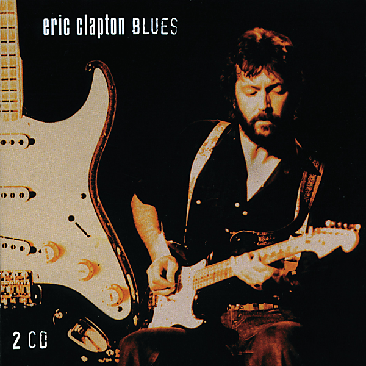

# Blind Faith

By Blind Faith

## Album Data

[Discogs URL](https://www.discogs.com/release/6404188-Blind-Faith-(2)-Blind-Faith)

- Catalog #: 06025 17753167
- Label: RSO
- Format: LP, Album, RE, 180
- Rating: 
- Released: 2013
- Release ID: 6404188
- Media condition: Mint (M)
- Sleeve condition: Mint (M)
- Speed: 33 rpm
- Weight: 

## Album Tracks

| **Position** | **Title** | **Duration** |
|--------------|-----------|--------------|
| A1 | **Had To Cry Today** | 8:49 |
| A2 | **Can't Find My Way Home** | 3:13 |
| A3 | **Well All Right** | 4:22 |
| A4 | **Presence Of The Lord** | 4:48 |
| B1 | **Sea Of Joy** | 5:19 |
| B2 | **Do What You Like** | 15:27 |

## Artist Roles

| **Name** | **Role** |
|----------|----------|
| **Chris Blackwell** | Arranged By [By Arrangement With] |
| **Robert Stigwood** | Arranged By [By Arrangement With] |
| **Bob Seidemann** | Artwork [Cover Design], Photography By [Photographed] |
| **Mick Milligan** | Artwork [Spaceship Built By] |
| **Jimmy Miller** | Producer [Produced By] |

## See also

- 
- [Beets: Blind Faith](../../Beets/Blind_Faith/Blind_Faith.md)
- [Roon: Blind Faith](../../Roon/Blind_Faith/Blind_Faith.md)
