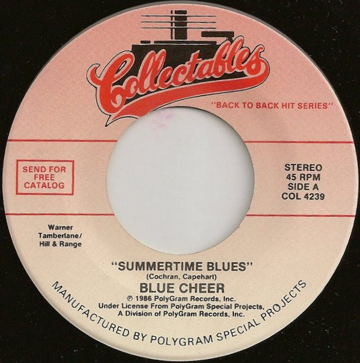

# Summertime Blues / Signs

By Blue Cheer / Five Man Electrical Band

## Album Data

[Discogs URL](https://www.discogs.com/release/8787584-Blue-Cheer-/-Five-Man-Electrical-Band-Summertime-Blues-/-Signs)

- Catalog #: COL 4239
- Label: Collectables
- Format: 7"
- Rating: 
- Released: 1986
- Release ID: 8787584
- Media condition: Near Mint (NM or M-)
- Sleeve condition: Near Mint (NM or M-)
- Speed: 45 rpm
- Weight: 

