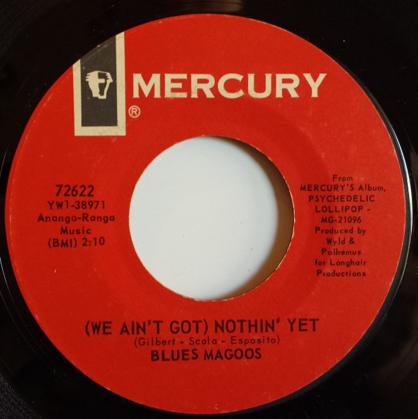

# (We Ain't Got) Nothin' Yet

By Blues Magoos

## Album Data

[Discogs URL](https://www.discogs.com/release/810379-Blues-Magoos-(We-Ain't-Got)-Nothin'-Yet)

- Catalog #: 72622
- Label: Mercury
- Formats: Vinyl, Mercury Pressing
- Format: 7", Single, Styrene, Mer, 45 RPM
- Rating: 
- Released: 1966
- Year: 1966
- Release ID: 810379
- Media condition: Very Good Plus (VG+)
- Sleeve condition: 
- Speed: 45 rpm
- Weight: 

## Album Tracks

| **Position** | **Title** | **Duration** |
|--------------|-----------|--------------|
| A | **(We Ain't Got) Nothin' Yet** | 2:10 |
| B | **Gotta Get Away** | 2:35 |

## Artist Roles

| **Name** | **Role** |
|----------|----------|
| **Art Polhemus** | Producer [Produced By] |
| **Bob Wyld** | Producer [Produced By] |

## See also

- 
