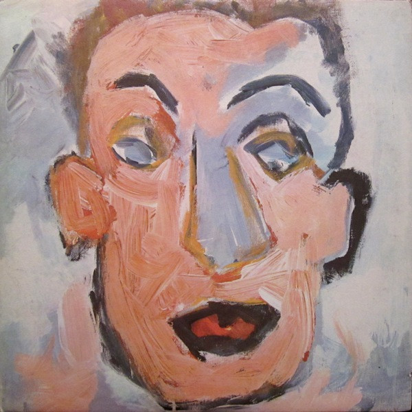

# Self Portrait

By Bob Dylan

## Album Data

[Discogs URL](https://www.discogs.com/release/3796450-Bob-Dylan-Self-Portrait)

- Catalog #: C2X 30050
- Label: Columbia
- Format: 2xLP, Album, Tex
- Rating: 
- Released: 1970
- Release ID: 3796450
- Media condition: Very Good Plus (VG+)
- Sleeve condition: Very Good Plus (VG+)
- Speed: 33 rpm
- Weight: 

## Album Tracks

| **Position** | **Title** | **Duration** |
|--------------|-----------|--------------|
| A1 | **All The Tired Horses** | 3:11 |
| A2 | **Alberta #1** | 2:55 |
| A3 | **I Forgot More Than You'll Ever Know** | 2:22 |
| A4 | **Days Of 49** | 5:42 |
| A5 | **Early Mornin' Rain** | 3:31 |
| A6 | **In Search Of Little Sadie** | 2:26 |
| B1 | **Let It Be Me** | 2:58 |
| B2 | **Little Sadie** | 1:58 |
| B3 | **Woogie Boogie** | 2:06 |
| B4 | **Belle Isle** | 2:28 |
| B5 | **Living The Blues** | 2:41 |
| B6 | **Like A Rolling Stone** | 5:14 |
| C1 | **Copper Kettle** | 3:32 |
| C2 | **Gotta Travel On** | 3:04 |
| C3 | **Blue Moon** | 2:26 |
| C4 | **The Boxer** | 2:45 |
| C5 | **The Mighty Quinn (Quinn, The Eskimo)** | 2:54 |
| C6 | **Take Me As I Am (Or Let Me Go)** | 2:59 |
| D1 | **Take A Message To Mary** | 2:44 |
| D2 | **It Hurts Me Too** | 3:16 |
| D3 | **Minstrel Boy** | 3:29 |
| D4 | **She Belongs To Me** | 2:42 |
| D5 | **Wigwam** | 3:08 |
| D6 | **Alberta #2** | 3:20 |

## See also

- 
- [Beets: Desire](../../Beets/Bob_Dylan/Desire.md)
- [Beets: Live At The 34th New Orleans Jazz & Heritage Festival](../../Beets/Bob_Dylan/Live_At_The_34th_New_Orleans_Jazz_and_Heritage_Festival.md)
- [Beets: The 30th Anniversary Concert Celebration - Disc 1](../../Beets/Bob_Dylan/The_30th_Anniversary_Concert_Celebration_-_Disc_1.md)
- [Beets: The Best of Bob Dylan](../../Beets/Bob_Dylan/The_Best_of_Bob_Dylan.md)
- [Beets: The Freewheelin' Bob Dylan](../../Beets/Bob_Dylan/The_Freewheelin_Bob_Dylan.md)
- [Roon: Blood On The Tracks](../../Roon/Bob_Dylan/Blood_On_The_Tracks.md)
- [Roon: Desire](../../Roon/Bob_Dylan/Desire.md)
- [Roon: Oh Mercy](../../Roon/Bob_Dylan/Oh_Mercy.md)
