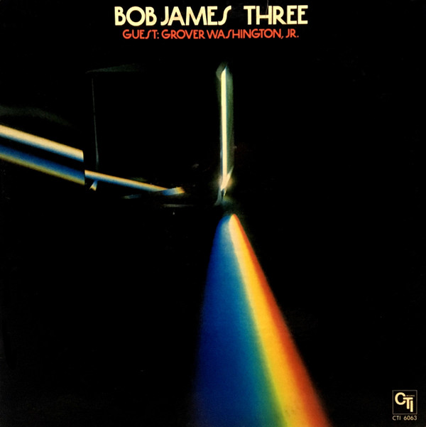

# Three

By Bob James

## Album Data

[Discogs URL](https://www.discogs.com/release/1392252-Bob-James-Three)

- Catalog #: CTI 6063
- Label: CTI Records
- Format: LP, Album, Pit
- Rating: 
- Released: 1976
- Release ID: 1392252
- Media condition: Very Good Plus (VG+)
- Sleeve condition: Very Good Plus (VG+)
- Speed: 33 rpm
- Weight: 

## Album Tracks

| **Position** | **Title** | **Duration** |
|--------------|-----------|--------------|
| A1 | **One Mint Julep** | 9:04 |
| A2 | **Women Of Ireland** | 8:00 |
| B1 | **Westchester Lady** | 7:23 |
| B2 | **Storm King** | 6:33 |
| B3 | **Jamaica Farewell** | 5:21 |

## See also

- [One](One.md)
- [Two](Two.md)
