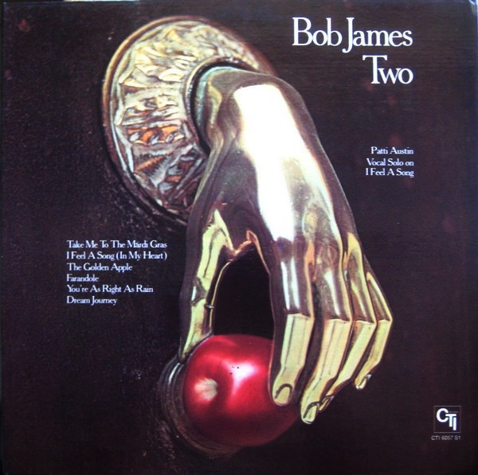

# Two

By Bob James

## Album Data

[Discogs URL](https://www.discogs.com/release/609588-Bob-James-Two)

- Catalog #: CTI 6057 S1
- Label: CTI Records
- Format: LP, Album, Ter
- Rating: 
- Released: 1975
- Release ID: 609588
- Media condition: Very Good Plus (VG+)
- Sleeve condition: Very Good Plus (VG+)
- Speed: 33 rpm
- Weight: 

## Album Tracks

| **Position** | **Title** | **Duration** |
|--------------|-----------|--------------|
| A1 | **Take Me To The Mardi Gras** | 5:50 |
| A2 | **I Feel A Song (In My Heart)** | 5:26 |
| A3 | **The Golden Apple** | 7:20 |
| B1 | **Farandole** | 8:24 |
| B2 | **You're As Right As Rain** | 5:29 |
| B3 | **Dream Journey** | 5:57 |

## See also

- [One](One.md)
- [Three](Three.md)
