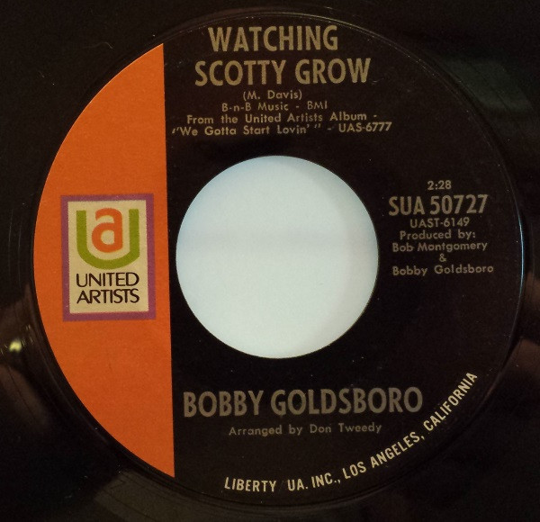

# Watching Scotty Grow / Water Color Days

By Bobby Goldsboro

## Album Data

[Discogs URL](https://www.discogs.com/release/4893720-Bobby-Goldsboro-Watching-Scotty-Grow-/-Water-Color-Days)

- Catalog #: SUA 50727
- Label: United Artists Records
- Format: 7", Single, Styrene, All
- Rating: 
- Released: 1970
- Release ID: 4893720
- Media condition: Very Good (VG)
- Sleeve condition: 
- Speed: 45 rpm
- Weight: 

## See also

- [Honey](Honey.md)
