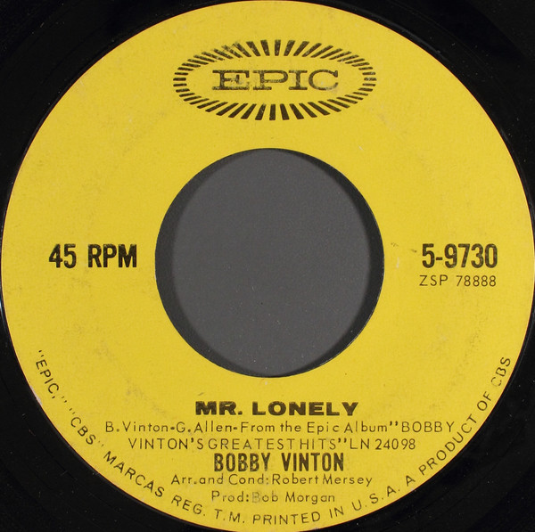

# Mr. Lonely / It's Better To Have Loved

By Bobby Vinton

## Album Data

[Discogs URL](https://www.discogs.com/release/6474810-Bobby-Vinton-Mr.-Lonely-/-It's-Better-To-Have-Loved)

- Catalog #: 5-9730
- Label: Epic
- Format: 7", Single
- Rating: 
- Released: 1964
- Release ID: 6474810
- Media condition: Good (G)
- Sleeve condition: 
- Speed: 45 rpm
- Weight: 

## See also

- 
- [Beets: 16 Most Requested Songs](../../Beets/Bobby_Vinton/16_Most_Requested_Songs.md)
- [Beets: 1964](../../Beets/Bobby_Vinton/1964.md)
- [Roon: Bobby Vinton's Greatest Hits](../../Roon/Bobby_Vinton/Bobby_Vintons_Greatest_Hits.md)
