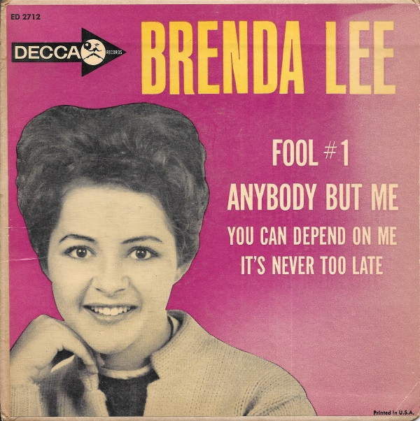

# Brenda Lee

By Brenda Lee

## Album Data

[Discogs URL](https://www.discogs.com/release/9729611-Brenda-Lee-Brenda-Lee)

- Catalog #: ED 2712
- Label: Decca
- Format: 7", EP
- Rating: 
- Released: 1961
- Release ID: 9729611
- Media condition: Very Good Plus (VG+)
- Sleeve condition: 
- Speed: 45 rpm
- Weight: 

## Notes

4 track extended play 45

## See also

- [I'm Sorry](Im_Sorry.md)
