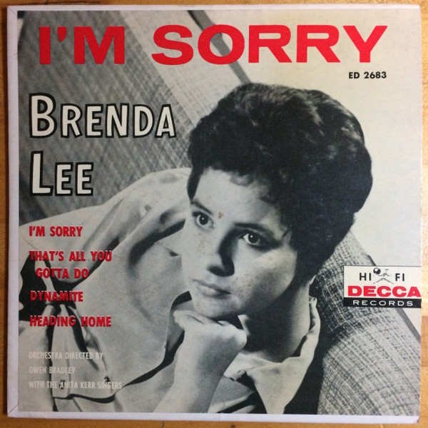

# I'm Sorry

By Brenda Lee

## Album Data

[Discogs URL](https://www.discogs.com/release/8770896-Brenda-Lee-I'm-Sorry)

- Catalog #: ED 2683
- Label: Decca
- Formats: Vinyl
- Format: 7", EP, 45 RPM
- Rating: 
- Released: 0
- Year: 0
- Release ID: 8770896
- Media condition: Very Good Plus (VG+)
- Sleeve condition: 
- Speed: 45 rpm
- Weight: 

## Album Tracks

| **Position** | **Title** | **Duration** |
|--------------|-----------|--------------|
| A1 | **I'm Sorry** |  |
| A2 | **That's All You Gotta Do** |  |
| B1 | **Dynamite** |  |
| B2 | **Heading Home** |  |

## See also

- [Brenda Lee](Brenda_Lee.md)
- [Beets: Anthology (1956-1980) Disc 1](../../Beets/Brenda_Lee/Anthology_1956-1980_Disc_1.md)
- [Beets: Unknown Album](../../Beets/Brenda_Lee/Unknown_Album.md)
- [Roon: The Definitive Collection](../../Roon/Brenda_Lee/The_Definitive_Collection.md)
