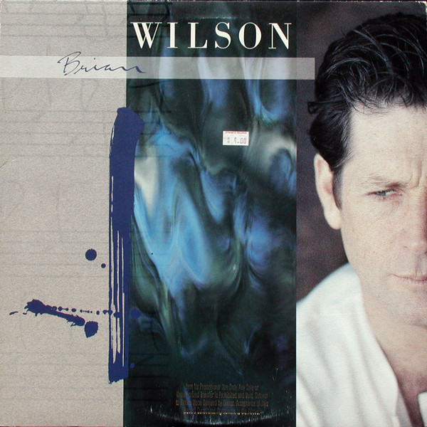

# Brian Wilson

By Brian Wilson

## Album Data

[Discogs URL](https://www.discogs.com/release/1479832-Brian-Wilson-Brian-Wilson)

- Catalog #: 1-25669, 9 25669-1
- Label: Sire, Sire, Reprise Records, Reprise Records
- Format: LP, Album, Spe
- Rating: 
- Released: 1988
- Release ID: 1479832
- Media condition: Very Good Plus (VG+)
- Sleeve condition: Very Good Plus (VG+)
- Speed: 33 rpm
- Weight: 

## Album Tracks

| **Position** | **Title** | **Duration** |
|--------------|-----------|--------------|
| A1 | **Love And Mercy** | 2:52 |
| A2 | **Walkin' The Line** | 2:37 |
| A3 | **Melt Away** | 2:58 |
| A4 | **Baby Let Your Hair Grow Long** | 3:15 |
| A5 | **Little Children** | 1:48 |
| A6 | **One For The Boys** | 1:47 |
| A7 | **There's So Many** | 2:46 |
| B1 | **Night Time** | 3:34 |
| B2 | **Let It Shine** | 3:57 |
| B3 | **Meet Me In My Dreams Tonight** | 3:05 |
| B4 | **Rio Grande** | 8:12 |

## See also

- 
- [Beets: SMiLE](../../Beets/Brian_Wilson/SMiLE.md)
- [Roon: Smile](../../Roon/Brian_Wilson/Smile.md)
