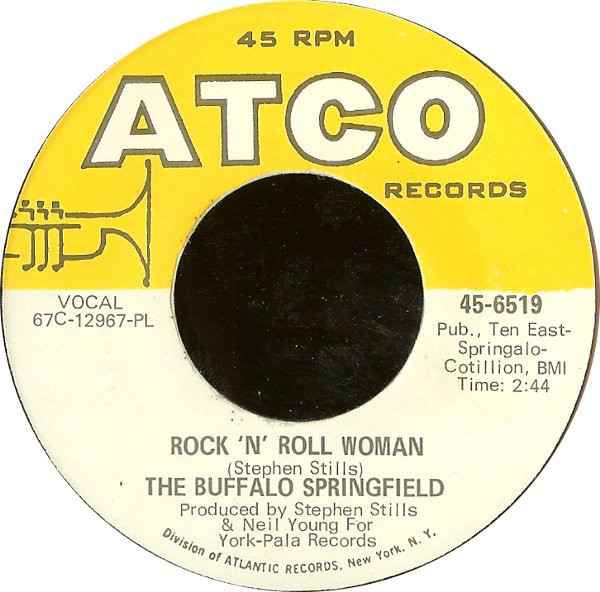

# Rock 'N' Roll Woman / A Child's Claim To Fame

By Buffalo Springfield

## Album Data

[Discogs URL](https://www.discogs.com/release/1527561-Buffalo-Springfield-Rock-'N'-Roll-Woman-/-A-Child's-Claim-To-Fame)

- Catalog #: 45-6519
- Label: ATCO Records
- Format: 7", Single, Pla
- Rating: 
- Released: 1967
- Release ID: 1527561
- Media condition: Very Good (VG)
- Sleeve condition: Very Good (VG)
- Speed: 45 rpm
- Weight: 

## See also

- [Last Time Around](Last_Time_Around.md)
