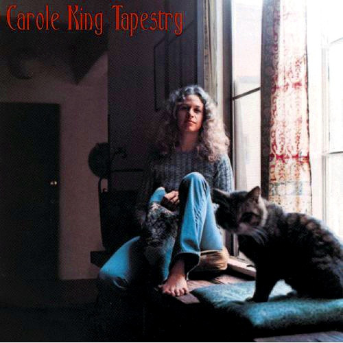

# Tapestry

By Carole King

## Album Data

[Discogs URL](https://www.discogs.com/release/8211921-Carole-King-Tapestry)

- Catalog #: 88875170161
- Label: Ode Records (2), Epic, Legacy, Sony Music
- Formats: Vinyl, 180 g
- Format: LP, Album, RE, 180
- Rating: 
- Released: 2016
- Year: 1971
- Release ID: 8211921
- Media condition: Mint (M)
- Sleeve condition: Mint (M)
- Speed: 33 rpm
- Weight: 180 gram

## Album Tracks

| **Position** | **Title** | **Duration** |
|--------------|-----------|--------------|
| A1 | **I Feel the Earth Move** |  |
| A2 | **So Far Away** |  |
| A3 | **It's Too Late** |  |
| A4 | **Home Again** |  |
| A5 | **Beautiful** |  |
| A6 | **Way Over Yonder** |  |
| A7 | **Out In The Cold** |  |
| B1 | **You've Got A Friend** |  |
| B2 | **Where You Lead** |  |
| B3 | **Will You Still Love Me Tomorrow?** |  |
| B4 | **Smackwater Jack** |  |
| B5 | **Tapestry** |  |
| B6 | **(You Make Me Feel Like) A Natural Woman** |  |
| B7 | **Smackwater Jack (Previously Unreleased Live Version)** |  |

## Artist Roles

| **Name** | **Role** |
|----------|----------|
| **Lou Adler** | Producer |
| **Carole King** | Written-By |
| **Gerry Goffin** | Written-By |
| **Jerry Wexler** | Written-By |
| **Toni Stern** | Written-By |

## See also

- 
- [Beets: Tapestry](../../Beets/Carole_King/Tapestry.md)
- [Roon: Tapestry](../../Roon/Carole_King/Tapestry.md)
