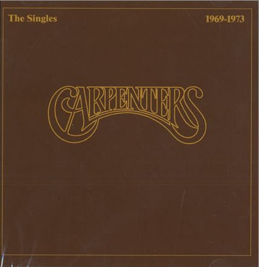

# The Singles 1969-1973

By Carpenters

## Album Data

[Discogs URL](https://www.discogs.com/release/4562731-Carpenters-The-Singles-1969-1973)

- Catalog #: AMNP 135
- Label: A&M Records
- Formats: Vinyl
- Format: LP, Album, Comp, RE, Compilation, Reissue
- Rating: 
- Released: 1983
- Year: 1973
- Release ID: 4562731
- Media condition: Very Good Plus (VG+)
- Sleeve condition: Very Good Plus (VG+)
- Speed: 33 rpm
- Weight: 

## Album Tracks

| **Position** | **Title** | **Duration** |
|--------------|-----------|--------------|
| A1 | **We've Only Just Begun** | 3:04 |
| A2 | **Top Of The World** | 2:56 |
| A3 | **Ticket To Ride** | 4:10 |
| A4 | **Superstar** | 3:49 |
| A5 | **Rainy Days And Mondays** | 3:40 |
| A6 | **Goodbye To Love** | 3:50 |
| B1 | **Yesterday Once More** | 3:50 |
| B2 | **It's Going To Take Some Time** | 2:55 |
| B3 | **Sing** | 3:20 |
| B4 | **For All We Know** | 2:34 |
| B5 | **Hurting Each Other** | 2:46 |
| B6 | **(They Long To Be) Close To You** | 4:34 |

## See also

- 
- [Beets: The Singles 1969–1973](../../Beets/Carpenters/The_Singles_1969–1973.md)
- [Roon: Carpenters With The Royal Philharmonic Orchestra](../../Roon/Carpenters/Carpenters_With_The_Royal_Philharmonic_Orchestra.md)
