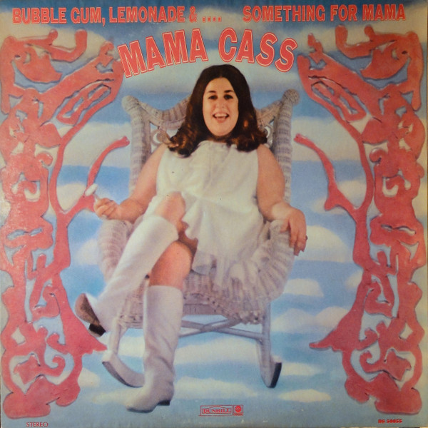

# "Bubble Gum, Lemonade &... Something For Mama"

By Cass Elliot

## Album Data

[Discogs URL](https://www.discogs.com/release/6546940-Cass-Elliot-"Bubble-Gum,-Lemonade-&...-Something-For-Mama")

- Catalog #: DS-50055
- Label: Dunhill, ABC Records
- Format: LP, Album
- Rating: 
- Released: 1969
- Release ID: 6546940
- Media condition: Very Good Plus (VG+)
- Sleeve condition: Very Good Plus (VG+)
- Speed: 33 rpm
- Weight: 

## Album Tracks

| **Position** | **Title** | **Duration** |
|--------------|-----------|--------------|
| A1 | **It's Getting Better** | 3:00 |
| A2 | **Blow Me A Kiss** | 2:50 |
| A3 | **Sour Grapes** | 2:35 |
| A4 | **Easy Come, Easy Go ** | 2:45 |
| A5 | **I Can Dream, Can't I** | 2:35 |
| A6 | **Welcome To The World ** | 2:18 |
| B1 | **Lady Love** | 3:04 |
| B2 | **He's A Runner** | 3:38 |
| B3 | **Move In A Little Closer, Baby ** | 2:38 |
| B4 | **When I Just Wear My Smile** | 2:20 |
| B5 | **Who's To Blame** | 2:55 |

## Artist Roles

| **Name** | **Role** |
|----------|----------|
| **Jimmie Haskell** | Accordion, Arranged By, Conductor |
| **Gary Burden** | Art Direction, Design |
| **Joe Osborn** | Bass |
| **Hal Blaine** | Drums, Percussion |
| **Phil Kaye** | Engineer, Percussion |
| **Mike Deasy** | Guitar |
| **Ben Benay** | Guitar, Harmonica |
| **Larry Knechtel** | Keyboards |
| **Henry Diltz** | Photography By |
| **Steve Barri** | Producer, Percussion |
| **Red Rhodes** | Steel Guitar |

## See also

- 
- [Roon: Bubblegum, Lemonade &...Something For Mama](../../Roon/Cass_Elliot/Bubblegum__Lemonade_andSomething_For_Mama.md)
- [Roon: Dave Mason & Cass Elliot](../../Roon/Cass_Elliot/Dave_Mason_and_Cass_Elliot.md)
- [Roon: Dream A Little Dream](../../Roon/Cass_Elliot/Dream_A_Little_Dream.md)
