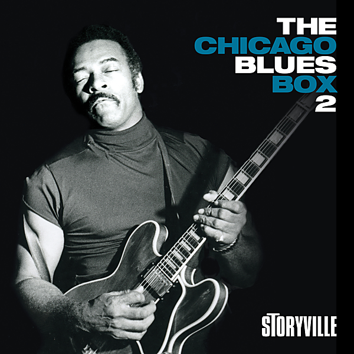

# Chicago VI

By Chicago

## Album Data

[Discogs URL](https://www.discogs.com/release/3663971-Chicago-(2)-Chicago-VI)

- Catalog #: FRM 32400
- Label: Friday Music
- Format: LP, Album, RE, RM, 180
- Rating: 
- Released: 2011
- Release ID: 3663971
- Media condition: Mint (M)
- Sleeve condition: Mint (M)
- Speed: 
- Weight: 180 gram

## See also

- 
- [Beets: Chicago II](../../Beets/Chicago/Chicago_II.md)
- [Beets: Chicago Transit Authority](../../Beets/Chicago/Chicago_Transit_Authority.md)
- [Beets: Chicago VI](../../Beets/Chicago/Chicago_VI.md)
- [Roon: Chicago II (Steven Wilson Remix)](../../Roon/Chicago/Chicago_II_Steven_Wilson_Remix.md)
- [Roon: Chicago Transit Authority (50th Anniversary Remix)](../../Roon/Chicago/Chicago_Transit_Authority_50th_Anniversary_Remix.md)
- [Roon: Chicago VI (Expanded & Remastered)](../../Roon/Chicago/Chicago_VI_Expanded_and_Remastered.md)
