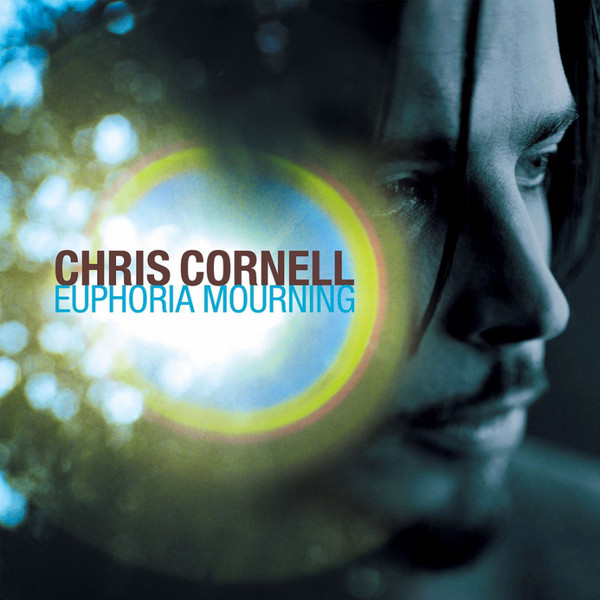

# Euphoria Mourning

By Chris Cornell

## Album Data

[Discogs URL](https://www.discogs.com/release/7351770-Chris-Cornell-Euphoria-Mourning)

- Catalog #: B0023457-01
- Label: A&M Records, Universal Music Enterprises
- Formats: Vinyl, 180g
- Format: LP, Album, RE, RM, 180
- Rating: 
- Released: 2015
- Year: 1999
- Release ID: 7351770
- Media condition: Mint (M)
- Sleeve condition: Mint (M)
- Speed: 33 rpm
- Weight: 180 gram

## Album Tracks

| **Position** | **Title** | **Duration** |
|--------------|-----------|--------------|
| A1 | **Can't Change Me** |  |
| A2 | **Flutter Girl** |  |
| A3 | **Preaching The End Of The World** |  |
| A4 | **Follow My Way** |  |
| A5 | **When I'm Down** |  |
| A6 | **Mission** |  |
| B1 | **Wave Goodbye** |  |
| B2 | **Moonchild** |  |
| B3 | **Sweet Euphoria** |  |
| B4 | **Disappearing One** |  |
| B5 | **Pillow Of Your Bones** |  |
| B6 | **Steel Rain** |  |

## Artist Roles

| **Name** | **Role** |
|----------|----------|
| **Alain Johannes** | Engineer |
| **Chris Cornell** | Engineer |
| **John Golden** | Lacquer Cut By |
| **Dave Collins** | Mastered By |
| **Alain Johannes** | Music By |
| **Chris Cornell** | Music By |
| **Natasha Shneider** | Music By |
| **Alain Johannes** | Producer, Arranged By, Mixed By |
| **Chris Cornell** | Producer, Arranged By, Mixed By |
| **Natasha Shneider** | Producer, Arranged By, Mixed By |
| **Andrew Garver** | Transferred By [Digital Transfers] |
| **Alain Johannes** | Words By |
| **Chris Cornell** | Words By |
| **Natasha Shneider** | Words By |

## See also

- 
- [Beets: Euphoria Morning](../../Beets/Chris_Cornell/Euphoria_Morning.md)
- [Beets: Euphoria Mourning](../../Beets/Chris_Cornell/Euphoria_Mourning.md)
- [Beets: Higher Truth](../../Beets/Chris_Cornell/Higher_Truth.md)
- [CD: ](../../CD/Chris_Cornell/Chris_Cornell.md)
- [CD: Euphoria Morning](../../CD/Chris_Cornell/Euphoria_Morning.md)
- [CD: Higher Truth](../../CD/Chris_Cornell/Higher_Truth.md)
- [Roon: Chris Cornell (Deluxe Edition)](../../Roon/Chris_Cornell/Chris_Cornell_Deluxe_Edition.md)
- [Roon: Euphoria Mourning](../../Roon/Chris_Cornell/Euphoria_Mourning.md)
