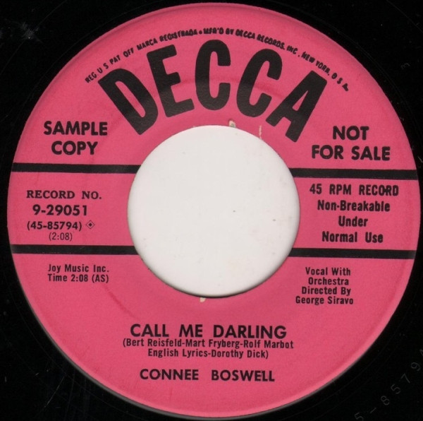

# Call Me Darling / The Philadelphia Waltz

By Connie Boswell

## Album Data

[Discogs URL](https://www.discogs.com/release/4962178-Connie-Boswell-Call-Me-Darling-/-The-Philadelphia-Waltz)

- Catalog #: 9-29051
- Label: Decca
- Format: 7", Promo
- Rating: 
- Released: 1954
- Release ID: 4962178
- Media condition: Very Good (VG)
- Sleeve condition: 
- Speed: 45 rpm
- Weight: 

