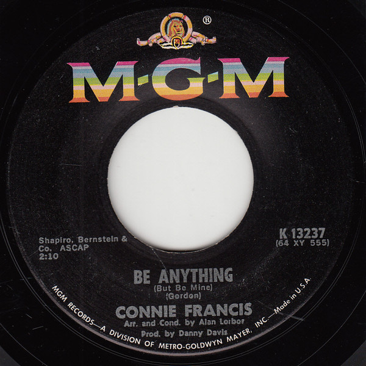

# Be Anything (But Be Mine) / Tommy

By Connie Francis

## Album Data

[Discogs URL](https://www.discogs.com/release/2238333-Connie-Francis-Be-Anything-(But-Be-Mine)-/-Tommy)

- Catalog #: K 13237
- Label: MGM Records
- Format: 7", Single
- Rating: 
- Released: 1964
- Release ID: 2238333
- Media condition: Fair (F)
- Sleeve condition: 
- Speed: 45 rpm
- Weight: 

## See also

- [Your Other Love / Whatever Happened To Rosemarie](Your_Other_Love_-_Whatever_Happened_To_Rosemarie.md)
