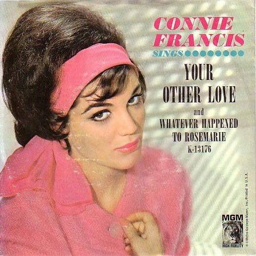

# Your Other Love / Whatever Happened To Rosemarie

By Connie Francis

## Album Data

[Discogs URL](https://www.discogs.com/release/1473028-Connie-Francis-Your-Other-Love-/-Whatever-Happened-To-Rosemarie)

- Catalog #: K-13176, K13176
- Label: MGM Records, MGM Records
- Formats: Vinyl
- Format: 7", Single
- Rating: 
- Released: 1963
- Year: 1963
- Release ID: 1473028
- Media condition: Very Good (VG)
- Sleeve condition: 
- Speed: 45 rpm
- Weight: 

## Album Tracks

| **Position** | **Title** | **Duration** |
|--------------|-----------|--------------|
| A | **Your Other Love** | 2:05 |
| B | **Whatever Happened To Rosemarie** | 2:05 |

## Artist Roles

| **Name** | **Role** |
|----------|----------|
| **Claus Ogerman** | Conductor, Arranged By |

## See also

- [Be Anything (But Be Mine) / Tommy](Be_Anything_But_Be_Mine_-_Tommy.md)
