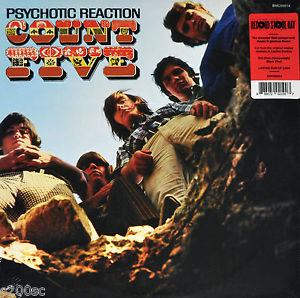

# Psychotic Reaction

By Count Five

## Album Data

[Discogs URL](https://www.discogs.com/release/10172301-Count-Five-Psychotic-Reaction)

- Catalog #: BMC00014
- Label: Concord Bicycle Music
- Format: LP, Album, Mono, Ltd, RE, 180
- Rating: 
- Released: 2017
- Release ID: 10172301
- Media condition: Mint (M)
- Sleeve condition: Mint (M)
- Speed: 33 rpm
- Weight: 180 gram

## Album Tracks

| **Position** | **Title** | **Duration** |
|--------------|-----------|--------------|
| A1 | **Double Decker Bus** | 2:00 |
| A2 | **Pretty Big Mouth** | 2:07 |
| A3 | **The World** | 2:12 |
| A4 | **My Generation** | 2:25 |
| A5 | **She's Fine** | 2:12 |
| A6 | **Psychotic Reaction** | 2:56 |
| B1 | **Peace Of Mind** | 2:17 |
| B2 | **They're Gonna Get You** | 2:25 |
| B3 | **The Morning After** | 2:55 |
| B4 | **Can't Get Your Lovin'** | 1:45 |
| B5 | **Out In The Street** | 2:25 |

## See also

- 
- [Beets: Psychotic Reaction](../../Beets/Count_Five/Psychotic_Reaction.md)
