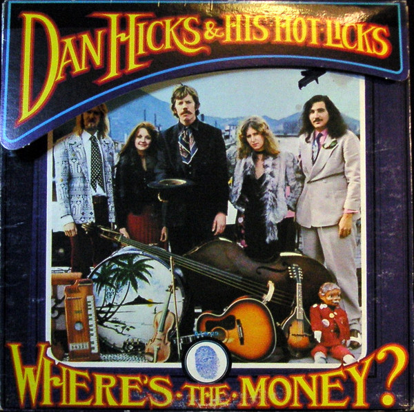

# Where's The Money?

By Dan Hicks And His Hot Licks

## Album Data

[Discogs URL](https://www.discogs.com/release/8014242-Dan-Hicks-And-His-Hot-Licks-Where's-The-Money?)

- Catalog #: BTS 29
- Label: Blue Thumb Records
- Format: LP, Album, RE, Ter
- Rating: 
- Released: 1974
- Release ID: 8014242
- Media condition: Very Good Plus (VG+)
- Sleeve condition: Very Good Plus (VG+)
- Speed: 33 rpm
- Weight: 

## See also

- [Original Recordings](Original_Recordings.md)
- [Striking It Rich!](Striking_It_Rich!.md)
