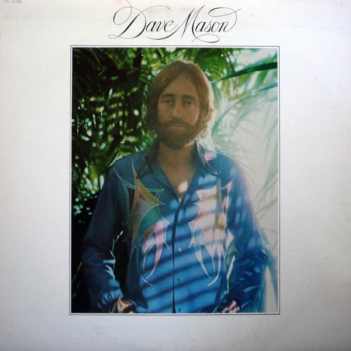

# Dave Mason

By Dave Mason

## Album Data

[Discogs URL](https://www.discogs.com/release/1734107-Dave-Mason-Dave-Mason)

- Catalog #: PC 33096
- Label: Columbia
- Format: LP, Album, San
- Rating: 
- Released: 1974
- Release ID: 1734107
- Media condition: Very Good (VG)
- Sleeve condition: Good (G)
- Speed: 33 rpm
- Weight: 

## Album Tracks

| **Position** | **Title** | **Duration** |
|--------------|-----------|--------------|
| A1 | **Show Me Some Affection** | 4:18 |
| A2 | **Get Ahold On Love** | 2:45 |
| A3 | **Every Woman** | 3:01 |
| A4 | **It Can't Make Any Difference To Me** | 2:17 |
| A5 | **All Along The Watchtower** | 4:03 |
| B1 | **Bring It On Home To Me** | 2:55 |
| B2 | **Harmony & Melody** | 3:35 |
| B3 | **Relation Ships** | 5:02 |
| B4 | **You Can't Take It When You Go** | 4:08 |

## Artist Roles

| **Name** | **Role** |
|----------|----------|
| **Bob Glaub** | Bass |
| **Lorrie Sullivan** | Design, Photography By |
| **Rick Jaeger** | Drums |
| **Linda Tyler** | Engineer [Assistant] |
| **Al Schmitt** | Engineer [Recording & Mixing] |
| **Jim Krueger** | Guitar, Vocals |
| **Mike Finnigan** | Keyboards, Vocals |
| **Arnie Acosta** | Mastered By |
| **Dave Mason** | Producer, Guitar, Lead Vocals, Design |

## See also

- 
- [Roon: Alone Together](../../Roon/Dave_Mason/Alone_Together.md)
- [Roon: Dave Mason & Cass Elliot](../../Roon/Dave_Mason/Dave_Mason_and_Cass_Elliot.md)
