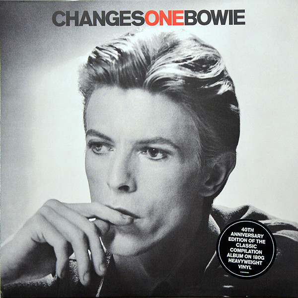

# ChangesOneBowie

By David Bowie

## Album Data

[Discogs URL](https://www.discogs.com/release/8518115-David-Bowie-ChangesOneBowie)

- Catalog #: COBLP 2016, 0190295994082
- Label: Parlophone, Parlophone
- Format: LP, Comp, RE, Cle
- Rating: 
- Released: 2016
- Release ID: 8518115
- Media condition: Mint (M)
- Sleeve condition: Mint (M)
- Speed: 33 rpm
- Weight: 180 gram

## See also

- [Aladdin Sane](Aladdin_Sane.md)
- [Cracked Actor (Live Los Angeles '74)](Cracked_Actor_Live_Los_Angeles_74.md)
- [David Bowie](David_Bowie.md)
- [Hunky Dory](Hunky_Dory.md)
- [Life On Mars?](Life_On_Mars.md)
- [The Man Who Sold The World](The_Man_Who_Sold_The_World.md)
- [The Rise And Fall Of Ziggy Stardust And The Spiders From Mars](The_Rise_And_Fall_Of_Ziggy_Stardust_And_The_Spiders_From_Mars.md)
- [Young Americans](Young_Americans.md)
