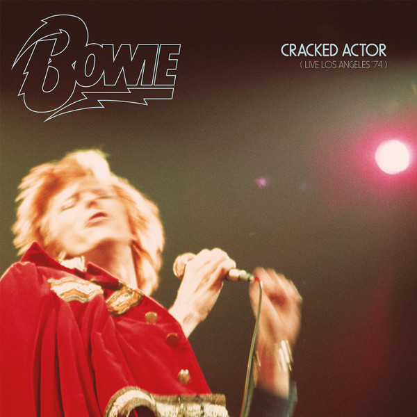

# Cracked Actor (Live Los Angeles '74)

By David Bowie

## Album Data

[Discogs URL](https://www.discogs.com/release/10144116-David-Bowie-Cracked-Actor-(Live-Los-Angeles-'74))

- Catalog #: 0190295869373, DBRSD 7476
- Label: Parlophone, Parlophone
- Formats: Vinyl
- Format: 2xLP + LP, S/Sided, Etch + Album, Ltd, Single Sided, Etched, Limited Edition
- Rating: 
- Released: 2017
- Year: 2017
- Release ID: 10144116
- Media condition: Mint (M)
- Sleeve condition: Mint (M)
- Speed: 33 rpm
- Weight: 

## Album Tracks

| **Position** | **Title** | **Duration** |
|--------------|-----------|--------------|
| A1 | **Introduction** | 1:47 |
| A2 | **1984** | 2:55 |
| A3 | **Rebel Rebel** | 2:31 |
| A4 | **Moonage Daydream** | 5:17 |
| A5 | **Sweet Thing / Candidate / Sweet Thing (Reprise)** | 7:41 |
| B1 | **Changes** | 3:47 |
| B2 | **Suffragette City** | 3:49 |
| B3 | **Aladdin Sane** | 5:01 |
| B4 | **All The Young Dudes** | 4:09 |
| B5 | **Cracked Actor** | 3:20 |
| C1 | **Rock 'N' Roll With Me** | 4:54 |
| C2 | **Knock On Wood** | 3:16 |
| C3 | **It's Gonna Be Me** | 7:11 |
| C4 | **Space Oddity** | 5:23 |
| D1 | **Diamond Dogs** | 6:58 |
| D2 | **Big Brother** | 4:05 |
| D3 | **Time** | 5:44 |
| E1 | **The Jean Genie** | 5:45 |
| E2 | **Rock 'N' Roll Suicide** | 5:10 |
| E3 | **John, I'm Only Dancing (Again)** | 8:41 |

## Artist Roles

| **Name** | **Role** |
|----------|----------|
| **David Sanborn** | Alto Saxophone, Flute |
| **Anthony Hinton** | Backing Vocals |
| **Ava Cherry** | Backing Vocals |
| **Diane Sumler** | Backing Vocals |
| **Luther Vandross** | Backing Vocals |
| **Robin Clark (2)** | Backing Vocals |
| **Warren Peace** | Backing Vocals |
| **Richard Grando** | Baritone Saxophone, Flute |
| **Doug Rauch** | Bass |
| **Pablo Rosario** | Congas |
| **Scott Minshall** | Design |
| **Greg Errico** | Drums |
| **Carlos Alomar** | Guitar |
| **Earl Slick** | Guitar |
| **Ray Staff** | Mastered By |
| **Tony Visconti** | Mixed By |
| **Jaime Andrews** | Photography By [Front Cover & Centre Spread] |
| **Terry O'Neill (2)** | Photography By [Inside Panel & Back Cover] |
| **Mike Garson** | Piano, Mellotron |
| **David Bowie** | Producer |
| **Aisha Cohen** | Producer [Project Produced For Release By For RZO Music] |
| **Nigel Reeve** | Producer [Project Produced For Release By For Warner Music] |
| **Olivia Thomas** | Producer [Project Produced For Release By For Warner Music] |
| **David Bowie** | Vocals, Guitar, Harmonica |
| **David Bowie** | Written-By |
| **Eddie Floyd** | Written-By |
| **Steve Cropper** | Written-By |
| **Warren Peace** | Written-By |

## See also

- [Aladdin Sane](Aladdin_Sane.md)
- [ChangesOneBowie](ChangesOneBowie.md)
- [David Bowie](David_Bowie.md)
- [Hunky Dory](Hunky_Dory.md)
- [Life On Mars?](Life_On_Mars.md)
- [The Man Who Sold The World](The_Man_Who_Sold_The_World.md)
- [The Rise And Fall Of Ziggy Stardust And The Spiders From Mars](The_Rise_And_Fall_Of_Ziggy_Stardust_And_The_Spiders_From_Mars.md)
- [Young Americans](Young_Americans.md)
- [Beets: Aladdin Sane](../../Beets/David_Bowie/Aladdin_Sane.md)
- [Beets: Best Of Bowie](../../Beets/David_Bowie/Best_Of_Bowie.md)
- [Beets: Bowie At The Beeb [Disc 1]](../../Beets/David_Bowie/Bowie_At_The_Beeb_[Disc_1].md)
- [Beets: Bowie At The Beeb [Disc 2]](../../Beets/David_Bowie/Bowie_At_The_Beeb_[Disc_2].md)
- [Beets: Bowie At The Beeb [Disc 3]](../../Beets/David_Bowie/Bowie_At_The_Beeb_[Disc_3].md)
- [Beets: ChangesOneBowie](../../Beets/David_Bowie/ChangesOneBowie.md)
- [Beets: Cracked Actor (Live Los Angeles '74)](../../Beets/David_Bowie/Cracked_Actor_Live_Los_Angeles_74.md)
- [Beets: Earthling](../../Beets/David_Bowie/Earthling.md)
- [Beets: Heathen](../../Beets/David_Bowie/Heathen.md)
- [Beets: Hunky Dory](../../Beets/David_Bowie/Hunky_Dory.md)
- [Beets: Life On Mars 45](../../Beets/David_Bowie/Life_On_Mars_45.md)
- [Beets: The Man Who Sold The World (2015 Remastered Version)](../../Beets/David_Bowie/The_Man_Who_Sold_The_World_2015_Remastered_Version.md)
- [Beets: The Man Who Sold the World](../../Beets/David_Bowie/The_Man_Who_Sold_the_World.md)
- [Beets: The Next Day Extra](../../Beets/David_Bowie/The_Next_Day_Extra.md)
- [Beets: The Next Day](../../Beets/David_Bowie/The_Next_Day.md)
- [Beets: Young Americans](../../Beets/David_Bowie/Young_Americans.md)
- [CD: Bowie At The Beeb (Disc 3)](../../CD/David_Bowie/Bowie_At_The_Beeb_Disc_3.md)
- [CD: ](../../CD/David_Bowie/David_Bowie.md)
- [Roon: Aladdin Sane (2013 Remaster)](../../Roon/David_Bowie/Aladdin_Sane_2013_Remaster.md)
- [Roon: Bowie at the Beeb (The Best of the BBC Sessions 1968-1972)](../../Roon/David_Bowie/Bowie_at_the_Beeb_The_Best_of_the_BBC_Sessions_1968-1972.md)
- [Roon: Brilliant Adventure (1992 – 2001)](../../Roon/David_Bowie/Brilliant_Adventure_1992_–_2001.md)
- [Roon: ChangesOneBowie](../../Roon/David_Bowie/ChangesOneBowie.md)
- [Roon: Cracked Actor (Live, Los Angeles '74)](../../Roon/David_Bowie/Cracked_Actor_Live__Los_Angeles_74.md)
- [Roon: Diamond Dogs (2016 Remaster)](../../Roon/David_Bowie/Diamond_Dogs_2016_Remaster.md)
- [Roon: Glastonbury 2000 (Live)](../../Roon/David_Bowie/Glastonbury_2000_Live.md)
- [Roon: Hunky Dory (2015 Remaster)](../../Roon/David_Bowie/Hunky_Dory_2015_Remaster.md)
- [Roon: Low (2017 Remaster)](../../Roon/David_Bowie/Low_2017_Remaster.md)
- [Roon: Space Oddity (2019 Mix)](../../Roon/David_Bowie/Space_Oddity_2019_Mix.md)
- [Roon: Station to Station (2016 Remaster)](../../Roon/David_Bowie/Station_to_Station_2016_Remaster.md)
- [Roon: The Rise and Fall of Ziggy Stardust and the Spiders from Mars (2012 Remaster)](../../Roon/David_Bowie/The_Rise_and_Fall_of_Ziggy_Stardust_and_the_Spiders_from_Mars_2012_Remaster.md)
- [Roon: Toy (Toy](../../Roon/David_Bowie/Toy_Toy-Box.md)
- [Roon: Young Americans (2016 Remaster)](../../Roon/David_Bowie/Young_Americans_2016_Remaster.md)
