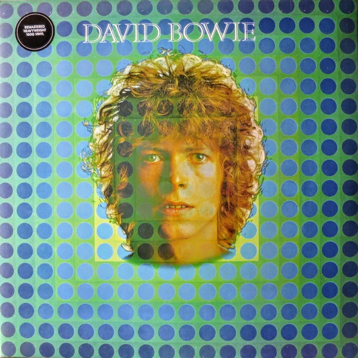

# David Bowie

By David Bowie

## Album Data

[Discogs URL](https://www.discogs.com/release/8161980-David-Bowie-David-Bowie)

- Catalog #: 0825646287390, DB69731, DB 69731
- Label: Parlophone, Parlophone, Parlophone
- Format: LP, Album, RE, RM, Gat
- Rating: 
- Released: 2016
- Release ID: 8161980
- Media condition: Mint (M)
- Sleeve condition: Mint (M)
- Speed: 33 rpm
- Weight: 180 gram

## Album Tracks

| **Position** | **Title** | **Duration** |
|--------------|-----------|--------------|
| A1 | **Space Oddity** |  |
| A2 | **Unwashed And Somewhat Slightly Dazed** |  |
| A3 | **Letter To Hermione** |  |
| A4 | **Cygnet Committee** |  |
| B1 | **Janine** |  |
| B2 | **An Occasional Dream** |  |
| B3 | **Wild Eyed Boy From Freecloud** |  |
| B4 | **God Knows I'm Good** |  |
| B5 | **Memory Of A Free Festival** |  |

## See also

- [Aladdin Sane](Aladdin_Sane.md)
- [ChangesOneBowie](ChangesOneBowie.md)
- [Cracked Actor (Live Los Angeles '74)](Cracked_Actor_Live_Los_Angeles_74.md)
- [Hunky Dory](Hunky_Dory.md)
- [Life On Mars?](Life_On_Mars.md)
- [The Man Who Sold The World](The_Man_Who_Sold_The_World.md)
- [The Rise And Fall Of Ziggy Stardust And The Spiders From Mars](The_Rise_And_Fall_Of_Ziggy_Stardust_And_The_Spiders_From_Mars.md)
- [Young Americans](Young_Americans.md)
- [Beets: Aladdin Sane](../../Beets/David_Bowie/Aladdin_Sane.md)
- [Beets: Best Of Bowie](../../Beets/David_Bowie/Best_Of_Bowie.md)
- [Beets: Bowie At The Beeb [Disc 1]](../../Beets/David_Bowie/Bowie_At_The_Beeb_[Disc_1].md)
- [Beets: Bowie At The Beeb [Disc 2]](../../Beets/David_Bowie/Bowie_At_The_Beeb_[Disc_2].md)
- [Beets: Bowie At The Beeb [Disc 3]](../../Beets/David_Bowie/Bowie_At_The_Beeb_[Disc_3].md)
- [Beets: ChangesOneBowie](../../Beets/David_Bowie/ChangesOneBowie.md)
- [Beets: Cracked Actor (Live Los Angeles '74)](../../Beets/David_Bowie/Cracked_Actor_Live_Los_Angeles_74.md)
- [Beets: Earthling](../../Beets/David_Bowie/Earthling.md)
- [Beets: Heathen](../../Beets/David_Bowie/Heathen.md)
- [Beets: Hunky Dory](../../Beets/David_Bowie/Hunky_Dory.md)
- [Beets: Life On Mars 45](../../Beets/David_Bowie/Life_On_Mars_45.md)
- [Beets: The Man Who Sold The World (2015 Remastered Version)](../../Beets/David_Bowie/The_Man_Who_Sold_The_World_2015_Remastered_Version.md)
- [Beets: The Man Who Sold the World](../../Beets/David_Bowie/The_Man_Who_Sold_the_World.md)
- [Beets: The Next Day Extra](../../Beets/David_Bowie/The_Next_Day_Extra.md)
- [Beets: The Next Day](../../Beets/David_Bowie/The_Next_Day.md)
- [Beets: Young Americans](../../Beets/David_Bowie/Young_Americans.md)
- [CD: Bowie At The Beeb (Disc 3)](../../CD/David_Bowie/Bowie_At_The_Beeb_Disc_3.md)
- [CD: ](../../CD/David_Bowie/David_Bowie.md)
- [Roon: Aladdin Sane (2013 Remaster)](../../Roon/David_Bowie/Aladdin_Sane_2013_Remaster.md)
- [Roon: Bowie at the Beeb (The Best of the BBC Sessions 1968-1972)](../../Roon/David_Bowie/Bowie_at_the_Beeb_The_Best_of_the_BBC_Sessions_1968-1972.md)
- [Roon: Brilliant Adventure (1992 – 2001)](../../Roon/David_Bowie/Brilliant_Adventure_1992_–_2001.md)
- [Roon: ChangesOneBowie](../../Roon/David_Bowie/ChangesOneBowie.md)
- [Roon: Cracked Actor (Live, Los Angeles '74)](../../Roon/David_Bowie/Cracked_Actor_Live__Los_Angeles_74.md)
- [Roon: Diamond Dogs (2016 Remaster)](../../Roon/David_Bowie/Diamond_Dogs_2016_Remaster.md)
- [Roon: Glastonbury 2000 (Live)](../../Roon/David_Bowie/Glastonbury_2000_Live.md)
- [Roon: Hunky Dory (2015 Remaster)](../../Roon/David_Bowie/Hunky_Dory_2015_Remaster.md)
- [Roon: Low (2017 Remaster)](../../Roon/David_Bowie/Low_2017_Remaster.md)
- [Roon: Space Oddity (2019 Mix)](../../Roon/David_Bowie/Space_Oddity_2019_Mix.md)
- [Roon: Station to Station (2016 Remaster)](../../Roon/David_Bowie/Station_to_Station_2016_Remaster.md)
- [Roon: The Rise and Fall of Ziggy Stardust and the Spiders from Mars (2012 Remaster)](../../Roon/David_Bowie/The_Rise_and_Fall_of_Ziggy_Stardust_and_the_Spiders_from_Mars_2012_Remaster.md)
- [Roon: Toy (Toy](../../Roon/David_Bowie/Toy_Toy-Box.md)
- [Roon: Young Americans (2016 Remaster)](../../Roon/David_Bowie/Young_Americans_2016_Remaster.md)
