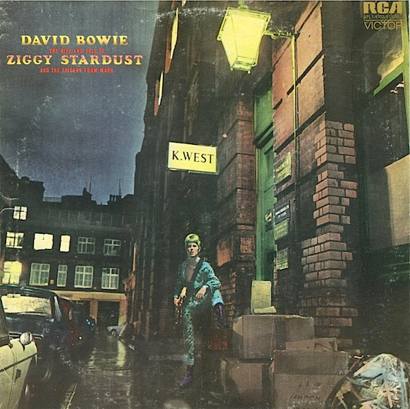

# The Rise And Fall Of Ziggy Stardust And The Spiders From Mars

By David Bowie

## Album Data

[Discogs URL](https://www.discogs.com/release/910031-David-Bowie-The-Rise-And-Fall-Of-Ziggy-Stardust-And-The-Spiders-From-Mars)

- Catalog #: AFL1-4702
- Label: RCA Victor
- Format: LP, Album, RE
- Rating: 
- Released: 1977
- Release ID: 910031
- Media condition: Very Good Plus (VG+)
- Sleeve condition: Very Good Plus (VG+)
- Speed: 33 rpm
- Weight: 

## See also

- [Aladdin Sane](Aladdin_Sane.md)
- [ChangesOneBowie](ChangesOneBowie.md)
- [Cracked Actor (Live Los Angeles '74)](Cracked_Actor_Live_Los_Angeles_74.md)
- [David Bowie](David_Bowie.md)
- [Hunky Dory](Hunky_Dory.md)
- [Life On Mars?](Life_On_Mars.md)
- [The Man Who Sold The World](The_Man_Who_Sold_The_World.md)
- [Young Americans](Young_Americans.md)
