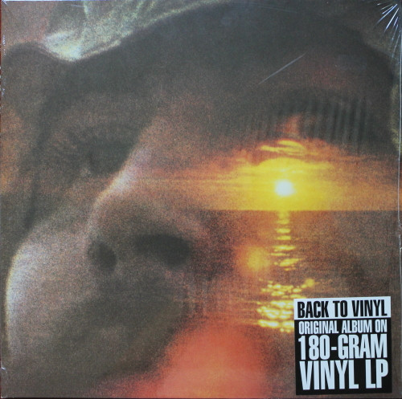

# If I Could Only Remember My Name

By David Crosby

## Album Data

[Discogs URL](https://www.discogs.com/release/3040270-David-Crosby-If-I-Could-Only-Remember-My-Name)

- Catalog #: SD 7203
- Label: Atlantic
- Formats: Vinyl, SP, Gatefold
- Format: LP, Album, RP, SP,
- Rating: 
- Released: 1975
- Year: 1971
- Release ID: 3040270
- Media condition: Good Plus (G+)
- Sleeve condition: Fair (F)
- Speed: 33 rpm
- Weight: 

## Album Tracks

| **Position** | **Title** | **Duration** |
|--------------|-----------|--------------|
| A1 | **Music Is Love** | 3:16 |
| A2 | **Cowboy Movie** | 8:02 |
| A3 | **Tamalpais High (At About 3)** | 3:28 |
| A4 | **Laughing** | 5:20 |
| B1 | **What Are Their Names** | 4:09 |
| B2 | **Traction In The Rain** | 3:40 |
| B3 | **Song With No Words (Tree With No Leaves)** | 5:53 |
| B4 | **Orleans** | 1:56 |
| B5 | **I'd Swear There Was Somebody Here** | 1:19 |

## Artist Roles

| **Name** | **Role** |
|----------|----------|
| **Bill Kreutzmann** | Performer |
| **David Crosby** | Performer |
| **David Freiberg** | Performer |
| **David Geffen** | Performer |
| **Elliot Roberts** | Performer |
| **Ethan Crosby** | Performer |
| **Gary Burden** | Performer |
| **Grace Slick** | Performer |
| **Graham Nash** | Performer |
| **Gregg Rolie** | Performer |
| **Henry Diltz** | Performer |
| **Jack Casady** | Performer |
| **Jerry Garcia** | Performer |
| **Joni Mitchell** | Performer |
| **Jorma Kaukonen** | Performer |
| **Laura Allan** | Performer |
| **Michael Shrieve** | Performer |
| **Mickey Hart** | Performer |
| **Neil Young** | Performer |
| **Paul Kantner** | Performer |
| **Phil Lesh** | Performer |
| **Robert Hammer (2)** | Performer |
| **Ronald Stone** | Performer |
| **Stephen Barncard** | Performer |
| **David Crosby** | Written-By |
| **Neil Young** | Written-By |

## See also

- 
- [Beets: If I Could Only Remember My Name](../../Beets/David_Crosby/If_I_Could_Only_Remember_My_Name.md)
- [Roon: Graham Nash David Crosby](../../Roon/David_Crosby/Graham_Nash_David_Crosby.md)
- [Roon: If I Could Only Remember My Name (50th Anniversary Edition; 2021 Remaster)](../../Roon/David_Crosby/If_I_Could_Only_Remember_My_Name_50th_Anniversary_Edition;_2021_Remaster.md)
- [Roon: If I Could Only Remember My Name](../../Roon/David_Crosby/If_I_Could_Only_Remember_My_Name.md)
