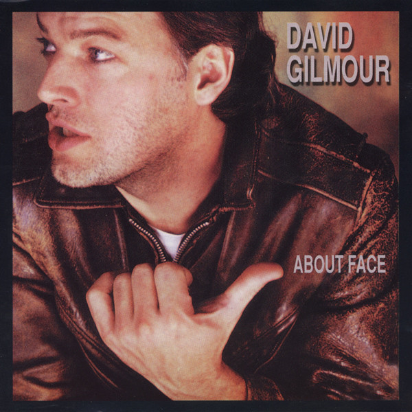

# About Face

By David Gilmour

## Album Data

[Discogs URL](https://www.discogs.com/release/6506066-David-Gilmour-About-Face)

- Catalog #: FC 39296, PC 39296
- Label: Columbia, Columbia
- Format: LP, Album, Car
- Rating: 
- Released: 1984
- Release ID: 6506066
- Media condition: Very Good Plus (VG+)
- Sleeve condition: Very Good Plus (VG+)
- Speed: 33 rpm
- Weight: 

