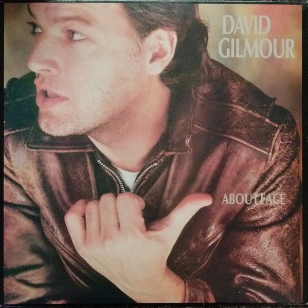

# About Face

By David Gilmour

## Album Data

[Discogs URL](https://www.discogs.com/release/6506066-David-Gilmour-About-Face)

- Catalog #: FC 39296, PC 39296
- Label: Columbia, Columbia
- Formats: Vinyl, Carrollton Press
- Format: LP, Album, Car
- Rating: 
- Released: 1984
- Year: 1984
- Release ID: 6506066
- Media condition: Very Good Plus (VG+)
- Sleeve condition: Very Good Plus (VG+)
- Speed: 33 rpm
- Weight: 

## Album Tracks

| **Position** | **Title** | **Duration** |
|--------------|-----------|--------------|
| A1 | **Until We Sleep** | 5:58 |
| A2 | **Murder** | 4:58 |
| A3 | **Love On The Air** | 4:18 |
| A4 | **Blue Light** | 4:35 |
| A5 | **Out Of The Blue** | 3:36 |
| B1 | **All Lovers Are Deranged** | 3:14 |
| B2 | **You Know I'm Right** | 5:04 |
| B3 | **Cruise** | 4:39 |
| B4 | **Let's Get Metaphysical** | 4:09 |
| B5 | **Near The End** | 5:43 |

## Artist Roles

| **Name** | **Role** |
|----------|----------|
| **Bob Ezrin** | Arranged By [Orchestra] |
| **Michael Kamen** | Arranged By [Orchestra] |
| **Pino Palladino** | Bass Guitar |
| **STd (3)** | Design |
| **Jeff Porcaro** | Drums, Percussion |
| **David Gilmour** | Guitar, Vocals |
| **Barbara Snow** | Horns [The Kick Horns] |
| **Roddy Lorimer** | Horns [The Kick Horns] |
| **Simon Clarke (2)** | Horns [The Kick Horns] |
| **Tim Sanders** | Horns [The Kick Horns] |
| **Bob Ezrin** | Keyboards |
| **EMKA Productions** | Management |
| **Steve O'Rourke (2)** | Management |
| **Doug Sax** | Mastered By |
| **Mike Reese** | Mastered By |
| **James Guthrie** | Mixed By |
| **Bob Parr** | Mixed By [Assistants] |
| **Ollie Fitzjones** | Mixed By [Assistants] |
| **Robert Hrycyna** | Mixed By [Assistants] |
| **David Gilmour** | Music By |
| **National Philharmonic Orchestra** | Orchestra |
| **Ian Kewley** | Organ [Hammond], Piano |
| **Luis Jardim** | Percussion |
| **Ray Cooper** | Percussion |
| **Davies And Starr** | Photography By |
| **Jill Furmanovsky** | Photography By |
| **Steve Winwood** | Piano, Organ |
| **Bob Ezrin** | Producer |
| **David Gilmour** | Producer |
| **Steve Rance** | Programmed By [Fairlight] |
| **Andy Jackson** | Recorded By |
| **Kit Woolven** | Recorded By |
| **Kevin Whyte** | Recorded By [Assistants] |
| **Mark Frank** | Recorded By [Assistants] |
| **Robert Hrycyna** | Recorded By [Assistants] |
| **Simon Sullivan** | Recorded By [Assistants] |
| **Eric Tomlinson** | Recorded By [Orchestra] |
| **Anne Dudley** | Synthesizer |
| **Jon Lord** | Synthesizer |
| **Phil Taylor (5)** | Technician [Equipment] |
| **Mick Feat** | Vocals |
| **Roy Harper** | Vocals |
| **Sam Brown** | Vocals |
| **Vicki Brown** | Vocals |
| **David Gilmour** | Words By |
| **Pete Townshend** | Words By |
| **David Gilmour** | Written-By |
| **Pete Townshend** | Written-By |

## See also

- 
- [Beets: Live In Gdansk [Disc 1]](../../Beets/David_Gilmour/Live_In_Gdansk_[Disc_1].md)
