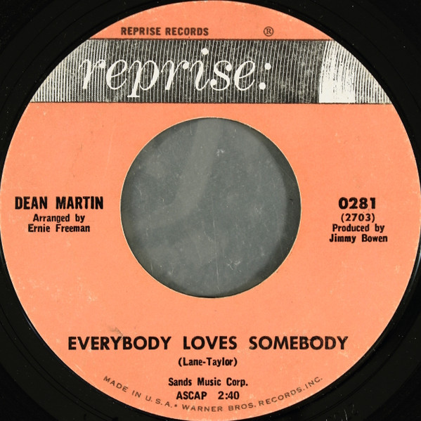

# Everybody Loves Somebody / A Little Voice

By Dean Martin

## Album Data

[Discogs URL](https://www.discogs.com/release/1577560-Dean-Martin-Everybody-Loves-Somebody-/-A-Little-Voice)

- Catalog #: 0281
- Label: Reprise Records
- Formats: Vinyl
- Format: 7", Single, Styrene
- Rating: 
- Released: 1964
- Year: 1964
- Release ID: 1577560
- Media condition: Good Plus (G+)
- Sleeve condition: 
- Speed: 45 rpm
- Weight: 

## Album Tracks

| **Position** | **Title** | **Duration** |
|--------------|-----------|--------------|
| A | **Everybody Loves Somebody** | 2:40 |
| B | **A Little Voice** | 2:05 |

## Artist Roles

| **Name** | **Role** |
|----------|----------|
| **Ernie Freeman** | Arranged By |
| **Jimmy Bowen** | Producer [Produced By] |

## See also

- ["Let Me Go, Lover"](Let_Me_Go__Lover.md)
- [Beets: Capitol Collectors Series](../../Beets/Dean_Martin/Capitol_Collectors_Series.md)
- [Beets: Return To Me (Box Set)](../../Beets/Dean_Martin/Return_To_Me_Box_Set.md)
