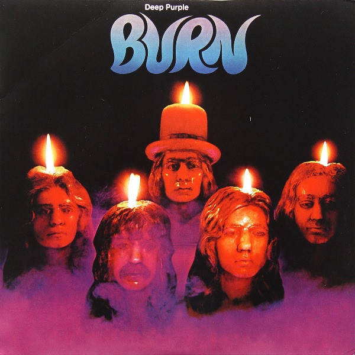

# Burn

By Deep Purple

## Album Data

[Discogs URL](https://www.discogs.com/release/3108814-Deep-Purple-Burn)

- Catalog #: FRM 2766
- Label: Friday Music, Purple Records
- Format: LP, Album, RE, 180
- Rating: 
- Released: 2010
- Release ID: 3108814
- Media condition: Mint (M)
- Sleeve condition: Mint (M)
- Speed: 33 rpm
- Weight: 180 gram

## See also

- [Deep Purple](Deep_Purple.md)
- [Fireball](Fireball.md)
- [In Concert '72](In_Concert_72.md)
- [In Rock](In_Rock.md)
- [Machine Head](Machine_Head.md)
- [Made In Japan](Made_In_Japan.md)
- [Shades Of Deep Purple](Shades_Of_Deep_Purple.md)
- [Who Do We Think We Are](Who_Do_We_Think_We_Are.md)
