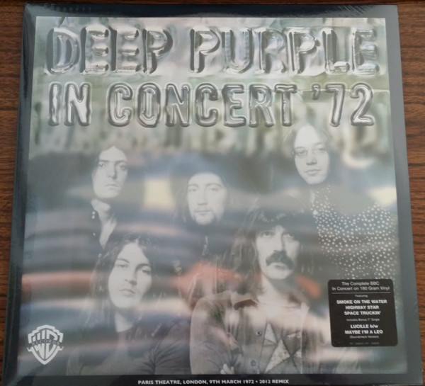

# In Concert '72

By Deep Purple

## Album Data

[Discogs URL](https://www.discogs.com/release/9114005-Deep-Purple-In-Concert-'72)

- Catalog #: R1-556690, R7-556690
- Label: Warner Bros. Records, Warner Bros. Records
- Format: 2xLP, Album, RE, 180 + 7", Single, RE
- Rating: 
- Released: 2016
- Release ID: 9114005
- Media condition: Mint (M)
- Sleeve condition: Mint (M)
- Speed: 33 rpm
- Weight: 180 gram

## See also

- [Burn](Burn.md)
- [Deep Purple](Deep_Purple.md)
- [Fireball](Fireball.md)
- [In Rock](In_Rock.md)
- [Machine Head](Machine_Head.md)
- [Made In Japan](Made_In_Japan.md)
- [Shades Of Deep Purple](Shades_Of_Deep_Purple.md)
- [Who Do We Think We Are](Who_Do_We_Think_We_Are.md)
