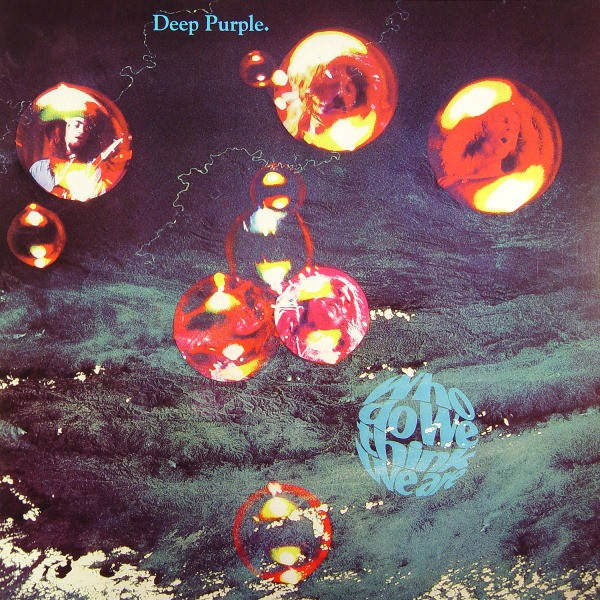

# Who Do We Think We Are

By Deep Purple

## Album Data

[Discogs URL](https://www.discogs.com/release/3147567-Deep-Purple-Who-Do-We-Think-We-Are)

- Catalog #: FRM 9018
- Label: Friday Music
- Format: LP, Album, RE, RM, Gat
- Rating: 
- Released: 2009
- Release ID: 3147567
- Media condition: Mint (M)
- Sleeve condition: Mint (M)
- Speed: 33 rpm
- Weight: 180 gram

## See also

- [Burn](Burn.md)
- [Deep Purple](Deep_Purple.md)
- [Fireball](Fireball.md)
- [In Concert '72](In_Concert_72.md)
- [In Rock](In_Rock.md)
- [Machine Head](Machine_Head.md)
- [Made In Japan](Made_In_Japan.md)
- [Shades Of Deep Purple](Shades_Of_Deep_Purple.md)
- [Beets: Burn](../../Beets/Deep_Purple/Burn.md)
- [Beets: Concerto for Group and Orchestra](../../Beets/Deep_Purple/Concerto_for_Group_and_Orchestra.md)
- [Beets: Deepest Purple](../../Beets/Deep_Purple/Deepest_Purple_2.md)
- [Beets: Deepest Purple](../../Beets/Deep_Purple/Deepest_Purple.md)
- [Beets: Deep Purple (2016 reissue)](../../Beets/Deep_Purple/Deep_Purple_2016_reissue.md)
- [Beets: Deep Purple in Concert](../../Beets/Deep_Purple/Deep_Purple_in_Concert.md)
- [Beets: Deep Purple in Rock](../../Beets/Deep_Purple/Deep_Purple_in_Rock.md)
- [Beets: Deep Purple](../../Beets/Deep_Purple/Deep_Purple.md)
- [Beets: inFinite](../../Beets/Deep_Purple/inFinite.md)
- [Beets: Live in London](../../Beets/Deep_Purple/Live_in_London.md)
- [Beets: Machine Head](../../Beets/Deep_Purple/Machine_Head.md)
- [Beets: Made in Europe](../../Beets/Deep_Purple/Made_in_Europe.md)
- [Beets: Made In Japan (Deluxe Edition)](../../Beets/Deep_Purple/Made_In_Japan_Deluxe_Edition.md)
- [Beets: Made in Japan](../../Beets/Deep_Purple/Made_in_Japan.md)
- [Beets: Perfect Strangers](../../Beets/Deep_Purple/Perfect_Strangers.md)
- [Beets: Shades of Deep Purple](../../Beets/Deep_Purple/Shades_of_Deep_Purple.md)
- [Beets: The Book of Taliesyn](../../Beets/Deep_Purple/The_Book_of_Taliesyn.md)
- [Beets: The Deep Purple Singles A’s & B’s](../../Beets/Deep_Purple/The_Deep_Purple_Singles_A’s_and_B’s.md)
- [Beets: Who Do We Think We Are](../../Beets/Deep_Purple/Who_Do_We_Think_We_Are.md)
- [Roon: Burn](../../Roon/Deep_Purple/Burn.md)
- [Roon: Concerto for Group and Orchestra](../../Roon/Deep_Purple/Concerto_for_Group_and_Orchestra.md)
- [Roon: Deep Purple](../../Roon/Deep_Purple/Deep_Purple.md)
- [Roon: Fireball](../../Roon/Deep_Purple/Fireball.md)
- [Roon: Infinite](../../Roon/Deep_Purple/Infinite.md)
- [Roon: In Rock](../../Roon/Deep_Purple/In_Rock.md)
- [Roon: Machine Head](../../Roon/Deep_Purple/Machine_Head.md)
- [Roon: Made in Japan (2014 Remaster)](../../Roon/Deep_Purple/Made_in_Japan_2014_Remaster.md)
- [Roon: Shades of Deep Purple](../../Roon/Deep_Purple/Shades_of_Deep_Purple.md)
- [Roon: The Book of Taliesyn](../../Roon/Deep_Purple/The_Book_of_Taliesyn.md)
- [Roon: Who Do We Think We Are (Deluxe Edition)](../../Roon/Deep_Purple/Who_Do_We_Think_We_Are_Deluxe_Edition.md)
